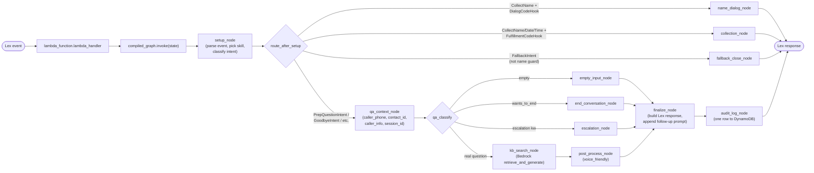

# Agentic-RAG edition

Parallel-stack refactor of `lambda_handler.py` from a single-file
direct-RAG implementation into a LangGraph-orchestrated agent. Sibling
to the existing prod stack (which stays untouched until cutover).

This folder is deployed as the Lambda function
`GIHealthcareLexFulfillment_agentic`. As of **2026-05-23** the
production Lex alias `TestBotAlias` has been flipped to invoke this
Lambda for both `en_US` and `es_US`, so the production phone number
`+1 877-427-9082` (which Amazon Connect routes through
`GI_Inbound_Main` -> `TestBotAlias`) is now served by the agentic
stack. A parallel alias `AgenticAlias` also points at the same Lambda
(originally used for isolated pre-cutover testing). The legacy zip
Lambda `GIHealthcareLexFulfillment` is still deployed and serves as
the one-paste rollback target (see **Phase 5: cutover + rollback**).

---

## Knowledge transfer walkthrough

Self-contained walkthrough designed for a knowledge-transfer session.
Read top-to-bottom for the order the material is best presented in. Some
content below overlaps with later sections (folder layout, graph
topology) on purpose -- this section is meant to be readable in one pass
without flipping around.

### 1. The 30-second mental model

The whole Lambda is **"one Lex event in, one Lex response out"**. Inside, the work is split into small **nodes** wired together as a **LangGraph state machine**. The graph reads a typed dictionary called `GraphState`, each node mutates a few fields of it, and the last node writes a `response` key that the Lambda returns to Lex.

Two big ideas separate this from v1:

1. **Code is organized by responsibility** -- one file per concern (event parsing, RAG, audit logging, each conversation branch) instead of one giant `lambda_handler.py`.
2. **Language config is data, not code** -- English / Spanish strings live in markdown files under `skills/`. Adding a language is "drop a file"; it never touches Python.

### 2. Folder structure -- what every file is for

```
AgenticRAG/
│
├── lambda_function.py            ← Lambda entry point. ~30 lines. Wraps the
│                                    Lex event in {"event": ...} and calls
│                                    compiled_graph.invoke(state). Returns
│                                    state["response"] to Lex.
│
├── Dockerfile                    ← Builds the arm64 container image
├── requirements.txt              ← langgraph, python-frontmatter, pyyaml
├── .dockerignore / .gitignore
│
├── ROLLBACK.ps1                  ← One-paste rollback (flips the Lex alias
│                                    Lambda hook back to v1)
├── _rollback_alias_to_prod.json
├── _testbotalias_snapshot_pre_cutover.json
│
├── README.md                     ← Deep-dive reference
│
├── agentic/                      ← THE BRAIN — LangGraph + everything it needs
│   │
│   ├── __init__.py               ← exports `compiled_graph`
│   │
│   ├── settings.py               ← Reads env vars (KB_ID, MODEL_ID,
│   │                                RETRIEVAL_MIN_SCORE, RETRIEVAL_TOP_K,
│   │                                STRICT_GROUNDING, CONVERSATION_TABLE_NAME)
│   │
│   ├── state.py                  ← GraphState (TypedDict). The shape of the
│   │                                dict that flows through every node.
│   │
│   ├── aws_clients.py            ← Lazy-init boto3 clients: bedrock-agent-runtime,
│   │                                dynamodb. One place for all AWS handles.
│   │
│   ├── skills_loader.py          ← At cold start, reads every skills/*.md
│   │                                file, validates it with Pydantic,
│   │                                caches the resulting Skill objects.
│   │                                Lookup helpers: get_skill("en") etc.
│   │
│   ├── extractors.py             ← Pure functions to pull fields out of the
│   │                                raw Lex event: lang_code, caller_phone,
│   │                                contact_id, session_attributes, the
│   │                                user utterance, the "caller-info blurb"
│   │                                that gets injected into the Bedrock prompt.
│   │
│   ├── text.py                   ← Text utilities: normalize_name (strip
│   │                                "my name is" prefix), needs_escalation
│   │                                (match safety keywords), wants_to_end
│   │                                (match goodbye keywords), voice_friendly
│   │                                (Polly-safe cleanup), redact_name.
│   │
│   ├── rag.py                    ← Wraps the two-stage Bedrock RAG call.
│   │                                Stage 1 = Retrieve (top_k=5, threshold
│   │                                gate). Stage 2 = RetrieveAndGenerate
│   │                                using the skill's prompt template.
│   │                                Returns answer + top_score + grounded flag.
│   │
│   ├── audit.py                  ← log_conversation_turn(): writes ONE row
│   │                                per Q&A turn to DynamoDB
│   │                                GIConversationTurns. Swallows errors
│   │                                so a bad write never breaks a call.
│   │
│   ├── graph.py                  ← ⭐ STITCHES IT ALL TOGETHER.
│   │                                Calls add_node/add_edge to declare the
│   │                                graph topology. compile() once at import.
│   │
│   └── nodes/                    ← One file per node. Each is a small function
│       │                            that takes GraphState and returns a partial dict.
│       │
│       ├── setup.py              ← FIRST NODE. Parses the event, picks the
│       │                            right Skill from langCode, classifies the
│       │                            intent, handles the "fallback-name-guard"
│       │                            re-route (FallbackIntent + collectionMode=name
│       │                            → CollectNameIntent).
│       │
│       ├── router.py             ← Pure switch function used as a LangGraph
│       │                            conditional edge. Reads effective_intent
│       │                            + invocation_source and returns the name
│       │                            of the next node. ZERO business logic.
│       │
│       ├── name_dialog.py        ← Spell-by-letter retry for English name
│       │                            collection (DialogCodeHook on
│       │                            CollectNameIntent only).
│       │
│       ├── collection.py         ← FulfillmentCodeHook for CollectNameIntent
│       │                            /CollectDateIntent/CollectTimeIntent.
│       │                            Writes raw transcript to a session
│       │                            attribute Connect reads back.
│       │
│       ├── fallback_close.py     ← FallbackIntent during Q&A. Returns
│       │                            Close with NO messages so Connect's
│       │                            GI_Check_Fallback block owns the
│       │                            spoken message (avoids double-speak).
│       │
│       └── qa.py                 ← ALL Q&A pipeline nodes in one file:
│                                   qa_context_node, qa_classify (conditional
│                                   edge fn), empty_input_node,
│                                   end_conversation_node, escalation_node,
│                                   kb_search_node, post_process_node,
│                                   finalize_node, audit_log_node.
│
├── skills/                       ← LANGUAGE PACKS (config-as-data)
│   │
│   ├── en.md                     ← English: keywords, canned strings,
│   │                                Bedrock prompt template
│   ├── es.md                     ← Spanish: same shape, translated content
│   │
│   ├── schema.py                 ← Pydantic models that VALIDATE the .md
│   │                                files at startup. Bad skill → container
│   │                                fails to start (not a live-call failure).
│   │
│   ├── loader.py                 ← Parses a single .md → typed Skill object
│   │                                (python-frontmatter + Pydantic validation)
│   │
│   └── __init__.py               ← exports load_skill, load_skills,
│                                    resolve_skill, Skill, Persona,
│                                    CannedStrings
│
├── sample_events/                ← INPUT FIXTURES. JSON files shaped like
│   ├── qa_en.json                  what Lex sends. Used for both unit tests
│   ├── qa_es.json                  AND live smoke tests
│   ├── collect_name_en.json        (`aws lambda invoke --payload file://...`).
│   ├── collect_date_en.json        One source of truth.
│   ├── escalation_en.json
│   └── fallback_name_guard.json
│
└── tests/                        ← THE TEST PYRAMID (191 tests, ~0.4s)
    ├── conftest.py               ← pytest setup + boto3 mocks
    ├── test_skills_loader.py     ← Unit (43): skill files parse + validate
    ├── test_extractors.py        ← Unit: event parsing helpers
    ├── test_text.py              ← Unit: text utilities
    ├── test_short_circuit_nodes.py  ← Unit: name_dialog / collection /
    │                                  fallback_close nodes
    ├── test_qa_nodes.py          ← Unit: individual Q&A nodes
    ├── test_graph_smoke.py       ← Integration: end-to-end through the
    │                                compiled graph
    └── test_parity_with_prod.py  ← ⭐ THE REGRESSION GATE. Imports BOTH
                                     the v1 lambda_handler.py and the new
                                     agentic graph, runs both on 22 input
                                     fixtures, asserts byte-for-byte
                                     identical Lex responses.
```

### 3. Boxes-and-arrows flow

Three diagrams, zooming in from the outside:

- **Diagram 0** — the full phone-call timeline. Shows that **one call triggers many Lambda invocations** (one per slot capture + one per Q&A turn).
- **Diagram 1** — what happens **inside one Lambda invocation**: the outer call path and the four router branches.
- **Diagram 2** — zoom into the Q&A branch of Diagram 1 (what `qa_context` actually does).

> **Common point of confusion.** Lex is **not** a single "do everything" service that's called once per call. Connect orchestrates the call and invokes Lex **separately** for the name, the date, the time, and **each** Q&A turn. **Every Lex invocation triggers the Lambda.** That is why the Lambda has both `collection_node` (handles slot-capture invocations) and the Q&A pipeline (handles real questions) -- the Lambda has to deal with **both kinds** of Lex events.

#### Diagram 0 — full call timeline (one call, many Lambda invocations)

```
Caller dials +1 877-427-9082
       │
       ▼
┌──────────────────────────────────────────────────────────────────────┐
│  AMAZON CONNECT  (contact flow GI_Inbound_Main — the orchestrator)   │
│  This is the thing that runs the whole call from start to finish.    │
└──────────────────────────────────────────────────────────────────────┘
       │
       ├─[1]── Connect plays "Hi, I'm Lucy..." greeting         (no Lex, no Lambda)
       │
       ├─[2]── Connect's language gate: "Press 1 for English"   (no Lex, no Lambda
       │       Caller presses 1 → langCode="en"                  — pure DTMF in Connect)
       │
       ├─[3]── Connect's GI_Collect_Name block:
       │       Connect invokes Lex  ──► Lex transcribes "Bob"  ──► Lex calls Lambda
       │                                                            (CollectNameIntent)
       │                                                                  │
       │                                                                  ▼
       │                                                          ┌──────────────┐
       │                                                          │  setup_node  │
       │                                                          │     ↓        │
       │                                                          │   router     │
       │                                                          │     ↓        │
       │                                                          │ collection_  │  ◄── THIS is
       │                                                          │    node      │      why it exists
       │                                                          │     ↓        │
       │                                                          │ writes       │
       │                                                          │ patientName  │
       │                                                          │ Raw="Bob"    │
       │                                                          └──────┬───────┘
       │       Connect's GI_Save_Name reads ◄──── Lex returns ◄──────────┘
       │       $.Lex.SessionAttributes.patientNameRaw → saves to contact attr
       │
       ├─[4]── Connect's GI_Collect_Date block:
       │       Connect invokes Lex  ──► Lex transcribes "May 28" ──► Lex calls Lambda
       │                                                              (CollectDateIntent)
       │                                                                  ▼
       │                                                          setup → router →
       │                                                          collection_node
       │                                                          writes procedureDateRaw
       │
       ├─[5]── Connect's GI_Collect_Time block:
       │       (same pattern — Lex invocation #3, Lambda invocation #3,
       │        collection_node captures procedureTimeRaw)
       │
       ├─[6]── Connect plays confirmation: "I have Bob, May 28, 9 AM. Press 1..."
       │       Caller presses 1                                  (no Lex, no Lambda)
       │
       ├─[7]── Connect's Q&A Lex bot block (Lex invocation #4):
       │       Connect invokes Lex  ──► "When do I start prep?" ──► Lex calls Lambda
       │                                                              (PrepQuestionIntent)
       │                                                                  ▼
       │                                                          setup → router →
       │                                                          qa_context → qa_classify →
       │                                                          kb_search → finalize →
       │                                                          audit_log
       │                                                          (RAG answer)
       │
       ├─[8]── Caller asks another question:
       │       Same pattern — Lex invocation #5, Lambda invocation #5,
       │       goes through the Q&A pipeline again
       │
       ├─[9]── Caller says "goodbye":
       │       Lex invocation #6, Lambda invocation #6,
       │       goes through end_conversation_node
       │
       └──── Connect disconnects
```

**Per-call totals for the scenario above:**

| Component | Invocations during one call |
| --- | --- |
| Amazon Connect | 1 (active throughout) |
| Amazon Lex | 6 (3 collection + 3 Q&A/goodbye) |
| AWS Lambda | 6 (one per Lex invocation) |
| Amazon Bedrock | 2 (only the real Q&A turns; goodbye and collection turns never call Bedrock) |
| DynamoDB audit rows | 3 (one per Q&A-pipeline turn, including the goodbye; collection turns don't log) |

#### Diagram 1 — inside one Lambda invocation: outer call path and router branches

```
                       Caller dials +1 877-427-9082
                                    │
                                    ▼
      ┌────────────────────────────────────────────────────────────┐
      │  AMAZON CONNECT  —  contact flow GI_Inbound_Main           │
      │                                                            │
      │  greeting  →  language gate  →  collect name/date/time     │
      │            →  confirm  →  Q&A loop                         │
      └────────────────────────────────────────────────────────────┘
                                    │
                                    ▼
      ┌────────────────────────────────────────────────────────────┐
      │  AMAZON LEX V2  —  GIHealthcareBot / TestBotAlias          │
      │                                                            │
      │  ASR  (speech → text)                                      │
      │  NLU  (text → intent + slots)                              │
      └────────────────────────────────────────────────────────────┘
                                    │
                                    │   FulfillmentCodeHook
                                    │   or  DialogCodeHook
                                    ▼
      ┌────────────────────────────────────────────────────────────┐
      │  AWS LAMBDA  —  GIHealthcareLexFulfillment_agentic         │
      │                  (container image, arm64)                  │
      │                                                            │
      │  lambda_function.py                                        │
      │    • wraps event in {"event": ...}                         │
      │    • calls compiled_graph.invoke(state)                    │
      │    • returns state["response"] to Lex                      │
      └────────────────────────────────────────────────────────────┘
                                    │
                                    ▼
                              ┌──────────┐
                              │  START   │
                              └─────┬────┘
                                    ▼
                  ┌──────────────────────────────┐
                  │         setup_node           │   nodes/setup.py
                  │                              │
                  │  • parse Lex event           │
                  │  • load Skill from langCode  │
                  │  • classify effective intent │
                  └──────────────┬───────────────┘
                                 ▼
                  ┌──────────────────────────────┐
                  │      route_after_setup       │   nodes/router.py
                  │                              │
                  │  conditional edge —          │
                  │  pure switch on              │
                  │  effective_intent +          │
                  │  invocation_source           │
                  └──────────────┬───────────────┘
                                 │
      ┌──────────────────────────┼──────────────────────────────────────┐
      │                          │                                      │
      │   3 SHORT-CIRCUIT BRANCHES                                Q&A BRANCH
      │   (own `response`, bypass Q&A pipeline,                   (Diagram 2 below)
      │    no Bedrock, no DynamoDB row)
      │                          │                                      │
      ▼                          ▼                                      ▼
 ┌─────────────────┐    ┌────────────────┐    ┌──────────────────┐    ┌─────────────────┐
 │   name_dialog   │    │   collection   │    │  fallback_close  │    │   qa_context    │
 │                 │    │                │    │                  │    │                 │
 │ spell-by-letter │    │ save name /    │    │ FallbackIntent   │    │ enters the Q&A  │
 │ retry           │    │ date / time to │    │ during Q&A —     │    │ pipeline        │
 │ (English only)  │    │ a session      │    │ we stay silent;  │    │                 │
 │                 │    │ attribute      │    │ Connect's flow   │    │ see DIAGRAM 2 ▼ │
 │ nodes/          │    │                │    │ owns the spoken  │    │                 │
 │ name_dialog.py  │    │ nodes/         │    │ message          │    │ nodes/qa.py     │
 │                 │    │ collection.py  │    │                  │    │                 │
 │                 │    │                │    │ nodes/           │    │                 │
 │                 │    │                │    │ fallback_close.py│    │                 │
 └────────┬────────┘    └───────┬────────┘    └────────┬─────────┘    └────────┬────────┘
          │                     │                      │                       │
          │                     │                      │                       ▼
          │                     │                      │            ┌─────────────────┐
          │                     │                      │            │  Q&A PIPELINE   │
          │                     │                      │            │   (Diagram 2)   │
          │                     │                      │            └────────┬────────┘
          │                     │                      │                     │
          ▼                     ▼                      ▼                     ▼
   ┌──────────────────────────────────────────────────────────────────────────────┐
   │                                    END                                       │
   │                  lambda returns state["response"] to Lex                     │
   └──────────────────────────────────────────────────────────────────────────────┘
                                       │
                                       ▼
                  LEX  →  CONNECT  →  POLLY  →  caller hears the answer
```

#### Diagram 2 — inside the Q&A branch

```
                  (entry from router's qa_context branch)
                                    │
                                    ▼
                  ┌──────────────────────────────┐
                  │       qa_context_node        │   nodes/qa.py
                  │                              │
                  │  • caller_phone              │
                  │  • contact_id                │
                  │  • caller_info blurb         │
                  │    (name + date + time)      │
                  │  • session_id                │
                  └──────────────┬───────────────┘
                                 ▼
                  ┌──────────────────────────────┐
                  │         qa_classify          │   nodes/qa.py
                  │                              │
                  │  conditional edge —          │
                  │  priority order:             │
                  │  empty > end > escalate      │
                  │  > answer                    │
                  └──────────────┬───────────────┘
                                 │
   ┌─────────────────────────────┼──────────────────────────────┬─────────────────────┐
   │                             │                              │                     │
   ▼                             ▼                              ▼                     ▼
┌─────────────────┐   ┌──────────────────┐   ┌──────────────────┐   ┌─────────────────┐
│ empty_input     │   │ end_conversation │   │   escalation     │   │   kb_search     │
│      _node      │   │      _node       │   │      _node       │   │      _node      │
│                 │   │                  │   │                  │   │                 │
│ "didn't catch   │   │ canned goodbye   │   │ canned safety    │   │ two-stage       │
│  that, please   │   │ message          │   │ message          │   │ Bedrock RAG     │
│  ask your prep  │   │                  │   │                  │   │ via rag.py      │
│  question"      │   │ no Bedrock       │   │ no Bedrock —     │   │                 │
│                 │   │                  │   │ deterministic    │   │ real LLM answer │
│ no Bedrock      │   │                  │   │                  │   │ + grounding     │
│                 │   │                  │   │                  │   │ gate            │
└────────┬────────┘   └────────┬─────────┘   └────────┬─────────┘   └────────┬────────┘
         │                     │                      │                      ▼
         │                     │                      │           ┌──────────────────┐
         │                     │                      │           │ post_process_    │
         │                     │                      │           │      node        │
         │                     │                      │           │                  │
         │                     │                      │           │ voice-friendly   │
         │                     │                      │           │ cleanup          │
         │                     │                      │           │ (RAG answers     │
         │                     │                      │           │  only)           │
         │                     │                      │           └─────────┬────────┘
         │                     │                      │                     │
         └─────────────────────┴──────────────────────┴─────────────────────┘
                                            ▼
                              ┌──────────────────────────────┐
                              │        finalize_node         │   nodes/qa.py
                              │                              │
                              │  • build Lex response        │
                              │  • append skill's            │
                              │    follow-up prompt          │
                              │    (unless close=True)       │
                              └──────────────┬───────────────┘
                                             ▼
                              ┌──────────────────────────────┐
                              │       audit_log_node         │   nodes/qa.py
                              │                              │
                              │  ONE row to DynamoDB         │
                              │  GIConversationTurns         │
                              │  (errors swallowed)          │
                              └──────────────┬───────────────┘
                                             ▼
                                            END
                          (control returns to Lex; continues
                           in Diagram 1 → caller hears answer)
```

**Three things to notice in this topology:**

1. **`setup_node` is the only place that parses the raw event.** Every downstream node reads pre-extracted fields from `GraphState`. The router is a pure switch with no business logic.
2. **Three branches short-circuit straight to `END`** (`name_dialog`, `collection`, `fallback_close`). They own their `response`, never run the Q&A pipeline, never call Bedrock, never write to DynamoDB. Slot-collection turns finish in ~4 ms.
3. **All Q&A branches converge at `finalize → audit_log → END`.** Even canned answers (empty input, goodbye, escalation) get an audit row. Only the `kb_search` branch detours through `post_process` first.

### 4. Every node, what it does, what file it lives in

| Node | File | When it runs | What it does |
| --- | --- | --- | --- |
| `setup_node` | `agentic/nodes/setup.py` | Always (entry node) | Parses `event` → fills `lang_code`, `intent_name`, `invocation_source`, `utterance`, `session_attributes_in`. Resolves the right `Skill` from `skills_loader.get_skill(lang_code)`. Handles the **fallback-name-guard**: if intent is `FallbackIntent` and `collectionMode=name`, sets `effective_intent=CollectNameIntent`. |
| `route_after_setup` | `agentic/nodes/router.py` | Conditional edge after setup | Pure switch on `effective_intent` + `invocation_source` → returns one of `BRANCH_NAME_DIALOG`, `BRANCH_COLLECTION`, `BRANCH_FALLBACK_CLOSE`, `BRANCH_QA`. No state mutation. |
| `name_dialog_node` | `agentic/nodes/name_dialog.py` | `CollectNameIntent` + `DialogCodeHook` | If slot filled → `FulfillIntent`. If empty + first try (English) → re-elicit with `SpellByLetter`. If retry exhausted or Spanish → give up gracefully (`FulfillIntent`, the FulfillmentCodeHook later writes "not provided"). |
| `collection_node` | `agentic/nodes/collection.py` | `CollectNameIntent` / `CollectDateIntent` / `CollectTimeIntent` + `FulfillmentCodeHook` (also fallback-name-guard) | Reads `event.inputTranscript`. If empty / `#` / `*` → write skill's `skip_placeholder` ("not provided"). For name: also strip "my name is" prefix via `text.normalize_name`. Writes captured value to `sessionAttributes.patientNameRaw / procedureDateRaw / procedureTimeRaw` so Connect's Save blocks can read it via `$.Lex.SessionAttributes.X`. Clears `collectionMode`. |
| `fallback_close_node` | `agentic/nodes/fallback_close.py` | `FallbackIntent` during Q&A | Returns `Close` with **empty `messages`**. Connect's `GI_Check_Fallback` block owns the counter and the spoken message — we stay silent to avoid double-speaking. |
| `qa_context_node` | `agentic/nodes/qa.py` | All real Q&A intents (`PrepQuestionIntent`, `GoodbyeIntent`, etc.) | Extracts `caller_phone`, `contact_id`, `patient_id`, `session_id`. Calls `extractors.extract_caller_info` to build `{patientName, procedureDate, procedureTime}` (filtering out skip placeholders). Sets defaults (`retrieval_top_score=None`, etc.). |
| `qa_classify` | `agentic/nodes/qa.py` | Conditional edge after `qa_context` | Priority order: **empty > end > escalate > answer**. Empty utterance → `QA_EMPTY`. Matches `end_conversation_keywords` → `QA_END`. Matches `escalation_keywords` → `QA_ESCALATE`. Else → `QA_ANSWER`. **Order matters** — changing it would change behavior (e.g., "bye" containing "chest pain"). |
| `empty_input_node` | `agentic/nodes/qa.py` | Empty utterance | Returns the skill's `empty_input_fallback`. **Never calls Bedrock** (incident note: empty input + caller blurb once generated a fully personalized prep schedule the caller never asked for). |
| `end_conversation_node` | `agentic/nodes/qa.py` | Goodbye keyword match | Returns the skill's `goodbye_message`. Sets `close_conversation=True` so `finalize_node` doesn't append the follow-up prompt. |
| `escalation_node` | `agentic/nodes/qa.py` | Safety keyword match | Returns the skill's `escalation_message` (canned, clinically-reviewed). Sets `close_conversation=True`. **Never calls Bedrock** — safety-critical answers are deterministic. |
| `kb_search_node` | `agentic/nodes/qa.py` | Real prep question | Calls `rag.retrieve_and_generate(region, utterance, blurb, skill)` which does the two-stage Bedrock call. On exception (Bedrock down, throttle): catches and returns the skill's `bedrock_error_template.format(exc=exc)` so the call never blows up. |
| `post_process_node` | `agentic/nodes/qa.py` | After `kb_search` only | Voice-friendly cleanup (collapse whitespace, normalize punctuation for Polly). Canned branches skip this — their text is already proofed. |
| `finalize_node` | `agentic/nodes/qa.py` | All Q&A branches | Builds the Lex response dict. If `close_conversation=False`, appends skill's `follow_up_prompt` ("What else can I help with?"). Sets `dialogAction=Close` (not `ElicitIntent` — that would strip the intent name and break Connect's flow conditions). |
| `audit_log_node` | `agentic/nodes/qa.py` | All Q&A branches | Calls `audit.log_conversation_turn(...)` → one row to DynamoDB `GIConversationTurns`. **Errors are swallowed** so a DDB hiccup never breaks a call. |

### 5. The `skills/` folder -- language packs as data

A **Skill** is a markdown file with **YAML frontmatter** (Cursor's skills convention reused). The frontmatter carries structured config; the markdown body is the literal Bedrock prompt template.

**`skills/en.md` looks like this:**

```markdown
---
language: en
locale_codes:
  - en
  - en_US
persona:
  name: Lucy
  role: UCSF GI prep voice assistant
polly_voice: Danielle
escalation_keywords:
  - 'chest pain'
  - "can't breathe"
  - 'bleeding heavily'
  - 'severe pain'
  - 'suicide'
  ...
end_conversation_keywords:
  - 'bye'
  - 'goodbye'
  - "that's all"
  ...
name_prefix_pattern: '^(?:my name is|i am|i''?m|this is|call me)\s+'
skip_placeholder: 'not provided'
canned:
  follow_up_prompt: 'What else can I help with?'
  no_answer_fallback: 'I could not find a clear answer ...'
  empty_input_fallback: "I didn't catch that. Please ask your GI prep question."
  goodbye_message: 'Thank you for calling. Goodbye.'
  escalation_message: 'For your safety, I am not able to handle emergency symptoms here. Please hold ...'
  bedrock_error_template: 'I could not reach the medical knowledge service right now. ({exc})'
---
You are Lucy, a UCSF GI prep voice assistant. You help patients prepare for colonoscopy ...

Answer the patient question using ONLY the information in the search results below.

Rules:
1. Reply in 2 to 4 sentences suitable for a phone call ...
2. Speak directly to the patient using "you".
3. Do NOT use outside knowledge ...
6. If the search results do not contain a clear answer ... respond with EXACTLY: NO_ANSWER_FOUND

Search results:
$search_results$

Patient question:
$query$

Patient-friendly answer:
```

**The pieces a skill carries:**

| Field | What it is | Used by |
| --- | --- | --- |
| `language` / `locale_codes` | Which language codes (`en`, `en_US`) this skill answers to | `skills_loader.resolve_skill()` |
| `persona` | Bot name and role description | (informational; not currently injected) |
| `polly_voice` | Polly voice name to pair with this locale | (documented for Connect-flow ops) |
| `escalation_keywords` | List of safety keywords | `text.needs_escalation()` → `escalation_node` |
| `end_conversation_keywords` | List of goodbye keywords | `text.wants_to_end()` → `end_conversation_node` |
| `name_prefix_pattern` | Regex to strip "my name is" / "call me" | `text.normalize_name()` → `collection_node` |
| `skip_placeholder` | What to write when caller skips a field | `collection_node`; filtered by `extractors.extract_caller_info` |
| `canned.*` | All six canned bot strings | `empty_input_node`, `end_conversation_node`, `escalation_node`, `kb_search_node` (error path), `finalize_node` (follow-up) |
| Markdown body | Bedrock prompt template with `$search_results$` and `$query$` placeholders | `rag.retrieve_and_generate()` passes this to Bedrock as `textPromptTemplate` |

**`skills/schema.py`** is the Pydantic source of truth for what fields a skill MUST contain. **`skills/loader.py`** parses each `.md` file with `python-frontmatter`, validates against the schema, and either returns a typed `Skill` object or **fails the container start** (so a bad skill is caught at deploy, not at a live call).

### 6. Adding a new language -- step by step

This is the punchline that justifies the whole agentic refactor. Adding a third language (say Hindi) is:

#### Inside this folder (the easy part, 10 minutes)

1. **Create `AgenticRAG/skills/hi.md`** -- copy `en.md`, translate the canned strings, escalation keywords, end-of-conversation keywords. Translate the prompt template body (or leave the rules English and let Nova answer in Hindi -- your choice).

2. **Verify the loader accepts it:**
   ```powershell
   cd AgenticRAG
   .\.venv\Scripts\python.exe -m pytest tests/test_skills_loader.py -v
   ```
   If the file is well-formed, you'll see one new skill appear in the test output.

3. **Rebuild the container and push:**
   ```powershell
   docker buildx build --platform linux/arm64 --provenance=false --sbom=false `
     -t 642058032951.dkr.ecr.us-east-1.amazonaws.com/gi-healthcare-lex-fulfillment-agentic:latest --push .

   aws lambda update-function-code `
     --function-name GIHealthcareLexFulfillment_agentic `
     --image-uri 642058032951.dkr.ecr.us-east-1.amazonaws.com/gi-healthcare-lex-fulfillment-agentic:latest
   ```

That's the entire Python-side change for a new language. **Zero edits to `agentic/`, zero new tests, no schema migration.**

#### Outside this folder (the AWS side, ~1 hour)

The Lambda's job is to *speak* the new language; you still have to teach Lex to *understand* it and Connect to *route* to it. Per the handover doc:

4. **Lex**: add an `hi_IN` locale to `GIHealthcareBot`. Copy intents (`PrepQuestionIntent`, `GoodbyeIntent`, `FallbackIntent`, `CollectNameIntent`, `CollectDateIntent`, `CollectTimeIntent`), translate sample utterances, build the locale. Wire the same agentic Lambda ARN as the FulfillmentCodeHook for this locale.

5. **Connect**: add a "press 3 for Hindi" branch to `GI_Inbound_Main`'s `GI_Lang_Gate`. Add a `GI_Set_Voice_HI` (Polly Kajal neural), `GI_Set_Lang_HI` (`LanguageCode=hi-IN`), and `GI_Set_Attrs_HI` (Hindi versions of every operator-visible string: `namePrompt`, `datePrompt`, `timePrompt`, `goAheadMsg`, `noInputMsg`, `defaultRetryMsg`, etc.).

6. **Test**: dial in, press 3, run through the standard scenarios (Q&A, collection, escalation, goodbye).

The key insight: **the Lambda side is decoupled from the AWS-resource side**. If you want to demo the new language pack without touching AWS, just write a sample event with `langCode=hi` in `session_attributes` and run it through `pytest` or `aws lambda invoke`.

### 7. Adding other kinds of "skills" (non-language)

The current skill schema is language-shaped, but the same pattern extends naturally. Three things you could add without restructuring:

- **A second persona for a different department.** Drop a `skills/en_cardiology.md` with different canned strings and prompt template. Change `skills_loader.resolve_skill()` to take a second dimension (department) alongside language.
- **A different prompt strategy.** The markdown body IS the prompt template. Want to A/B test a more concise prompt? Make `skills/en_v2.md` and have a router pick between them based on an env var.
- **Per-skill tool definitions.** If you go beyond Interpretation B and want the LLM to call actual tools (Interpretation A -- true agentic), extend the schema with a `tools:` list in frontmatter and have a new agentic node read it.

The reason this works is the **separation between `skills/` (data) and `agentic/` (orchestration)**. Adding a skill type never touches the graph; the graph just looks up "give me the right skill for this turn" and reads its fields.

### Suggested KT presentation order (5-7 minutes)

If you only have a few minutes in the meeting, present in this order:

1. **"Why we refactored"** -- 1 sentence. *"v1 worked, but adding a language meant editing Python in five places; v3 lets us drop one markdown file."*
2. **The mental model** -- the 3 sentences in §1 above.
3. **The folder tour** -- open `AgenticRAG/` in the IDE and walk through the tree from §2 above.
4. **One worked example** -- open `sample_events/qa_en.json`, then walk through the ASCII diagram saying "the event goes here → setup parses it → router picks Q&A → qa_context builds the patient blurb → qa_classify decides this is a real question → kb_search calls Bedrock → post_process cleans up → finalize builds the Lex response → audit_log writes the row → done."
5. **Skills demo** -- open `skills/en.md` and `skills/es.md` side by side. Point out that they're the *only* place language-specific content lives.
6. **"Adding Hindi"** -- walk through §6 above (the file → rebuild → push flow is the whole pitch).
7. **Safety story** -- `escalation_node` and `empty_input_node` are deterministic; Bedrock is never asked about chest pain or empty input. The grounding gate (`RETRIEVAL_MIN_SCORE`) and the prompt's `NO_ANSWER_FOUND` contract make the bot incapable of inventing medical content.
8. **Tests + parity** -- `test_parity_with_prod.py` runs v1 and v3 side-by-side on 22 scenarios and asserts identical output. That's how we knew the cutover was safe.

---

## Architectural deltas vs. `../lambda_handler.py`

| Concern | Prod (`../lambda_handler.py`) | Agentic-RAG (this folder) |
| --- | --- | --- |
| Orchestration | Single Python function with branching `if` chains | LangGraph `StateGraph` with explicit nodes |
| Language config | `LANG_STRINGS` + `PROMPT_TEMPLATES` dicts inline in the Lambda | One markdown file per language under `skills/`, parsed at cold start |
| Adding a language | ~80 line edit across multiple constants + clinical review of safety keywords | Drop one `skills/<lang>.md` file, rebuild container, done |
| Deployment artifact | 14 KB Python zip | ~150 MB container image (arm64, ECR-hosted) |
| Per-turn LLM calls | One (Bedrock `retrieve_and_generate`) | One (same — Interpretation B, deterministic kb_search node feeds the LLM) |
| Latency | ~1.2 s warm | ~1.2 s warm (no extra LLM round-trip) |

## Folder layout

Grouped by purpose so it's clear which files you reach for when:

```
AgenticRAG/
├── 📦 DEPLOYMENT ARTIFACTS — how the code gets to AWS
│   ├── Dockerfile                         # container image recipe (arm64, python:3.13)
│   ├── requirements.txt                   # pinned pip deps (langgraph, pyyaml, ...)
│   ├── .dockerignore                      # what NOT to bake into the image
│   └── .gitignore
│
├── 🔁 CUTOVER + ROLLBACK ARTIFACTS — created during Phase 5
│   ├── ROLLBACK.ps1                       # one-paste script to flip back to prod Lambda
│   ├── _rollback_alias_to_prod.json       # payload used by ROLLBACK.ps1
│   └── _testbotalias_snapshot_pre_cutover.json   # snapshot of TestBotAlias before flip
│
├── 📖 DOCUMENTATION
│   └── README.md                          # phase-by-phase history + runbooks (this file)
│
├── 🚪 ENTRY POINT
│   └── lambda_function.py                 # what Lex calls; ~30 lines, just runs the graph
│
├── 🌐 LANGUAGE PACKS (config-as-data)
│   └── skills/
│       ├── en.md                          # English: keywords, canned strings, prompt template
│       ├── es.md                          # Spanish: same shape, different content
│       ├── schema.py                      # Pydantic models that VALIDATE the .md files at startup
│       ├── loader.py                      # parses .md → typed Skill object
│       └── __init__.py
│
├── 🧠 AGENT CORE (the LangGraph + everything it needs)
│   └── agentic/
│       ├── settings.py                    # env var parsing (KB_ID, MODEL_ID, thresholds, ...)
│       ├── state.py                       # GraphState (TypedDict that flows through the graph)
│       ├── aws_clients.py                 # boto3 clients (bedrock-agent, dynamodb)
│       ├── skills_loader.py               # cold-start cache of all skills
│       ├── extractors.py                  # pure functions to pull data out of the Lex event
│       ├── text.py                        # text utils (escalation check, name redaction, ...)
│       ├── rag.py                         # Bedrock KB retrieve + retrieve_and_generate
│       ├── audit.py                       # write one row to DynamoDB per turn
│       ├── graph.py                       # ⭐ wires all nodes together into a StateGraph
│       └── nodes/                         # each node is a single responsibility
│           ├── setup.py                       # parse event, pick skill, classify intent
│           ├── router.py                      # decide which branch to take next
│           ├── name_dialog.py                 # spell-by-letter elicitation
│           ├── collection.py                  # capture name/date/time slots
│           ├── fallback_close.py              # graceful close on unrecognized intent
│           └── qa.py                          # ALL Q&A nodes (classify, kb_search, finalize, log)
│
├── 🎬 SAMPLE EVENTS — input fixtures for testing
│   └── sample_events/
│       ├── qa_en.json                     # English Q&A
│       ├── qa_es.json                     # Spanish Q&A
│       ├── collect_name_en.json           # name collection turn
│       ├── collect_date_en.json           # date collection turn
│       ├── escalation_en.json             # "I have chest pain"
│       └── fallback_name_guard.json       # bare-name + collectionMode=name
│
└── 🧪 TESTS — the pyramid
    └── tests/
        ├── conftest.py                    # pytest setup, env vars, boto3 mocks
        ├── test_skills_loader.py          # unit: skill files parse + validate (43 tests)
        ├── test_extractors.py             # unit: event parsing helpers
        ├── test_text.py                   # unit: text utilities
        ├── test_short_circuit_nodes.py    # unit: name_dialog / collection / fallback_close nodes
        ├── test_qa_nodes.py               # unit: individual Q&A nodes
        ├── test_graph_smoke.py            # integration: end-to-end through the compiled graph
        └── test_parity_with_prod.py       # ⭐ runs OLD and NEW Lambda side-by-side on 22 scenarios
                                             and asserts byte-for-byte identical Lex responses
```

## The mental model in 3 sentences

1. **When a call comes in**, Lex sends a JSON event to `lambda_function.py`, which dumps it into a `GraphState` dict and calls `compiled_graph.invoke(state)`.
2. **The graph walks through nodes** — first `setup` (parse), then `router` (which branch?), then either a short-circuit branch (collection / name dialog / fallback) **or** the full Q&A pipeline (classify → kb_search → finalize → audit_log).
3. **Each node mutates the state**; the final node writes a `response` field that the entry point returns to Lex.

## What lives where, by "if I want to change X, I edit Y"

| You want to change… | Edit this file |
| --- | --- |
| English wording the bot speaks (canned messages, prompt template) | `skills/en.md` |
| Spanish wording | `skills/es.md` |
| Add a new language (e.g., Hindi) | Drop a new `skills/hi.md`, rebuild |
| Escalation keywords ("chest pain", "bleeding") | `skills/<lang>.md` frontmatter |
| Retrieval threshold / top-k / strict grounding | Lambda env var (parsed by `agentic/settings.py`) |
| How the Lex event is parsed (caller phone, contactId, etc.) | `agentic/extractors.py` |
| What constitutes a "name redacted" / "escalation triggered" | `agentic/text.py` |
| Which Bedrock model / KB / prompt is used | `agentic/rag.py` + env vars |
| What gets written to DynamoDB | `agentic/audit.py` |
| Add a new conditional branch in the conversation flow | New node in `agentic/nodes/`, wire into `agentic/graph.py` |
| Behavior of the name-spelling dialog | `agentic/nodes/name_dialog.py` |
| Behavior of all Q&A turns (classify, retrieve, generate, post-process) | `agentic/nodes/qa.py` |

## What's intentionally separated (and why)

| Separation | Why |
| --- | --- |
| **`skills/` vs `agentic/`** | Configuration (language packs) vs. code (orchestration). Adding a language never touches Python; changing flow never touches markdown. |
| **`agentic/nodes/*` vs `agentic/graph.py`** | Each node does ONE thing and is independently testable. The graph file is the only place that knows how they connect. You can rearrange the flow without touching node logic. |
| **`agentic/extractors.py`, `text.py`, `rag.py`, `audit.py`** | Pure utilities, no LangGraph dependency. They get unit-tested in isolation and could be reused by a non-LangGraph caller (e.g., a future REST endpoint). |
| **`tests/test_parity_with_prod.py`** | The regression gate. Imports BOTH `../lambda_handler.py` (prod) and the new agentic graph, runs both on 22 input fixtures, and asserts the outputs are byte-identical. This is what gave us the confidence to do the cutover. |
| **`sample_events/` vs `tests/`** | Same JSON files serve two purposes: as input fixtures for parity tests AND as `aws lambda invoke --payload file://...` inputs for live smoke tests. One source of truth. |

## What's NOT in this folder (and lives in the parent)

- `../lambda_handler.py` — the old prod Lambda. Kept as the rollback target and as the source of truth for the parity tests.
- `../README.md` — system-wide documentation (architecture diagrams, compliance posture).
- `../LexV2&AMZNTranslate/` — the abandoned parallel "Lex + Amazon Translate" experiment.

The folder is small enough that everything is one click away, and the boundaries are clean enough that future changes (new language, new Bedrock model, new node in the flow) only touch one place.

## How it works: end-to-end workflow

The whole system is "one Lex event in, one Lex response out". The
StateGraph is the brain in the middle. Below is the topology, then
three worked examples (one Q&A turn, one collection turn, one
escalation turn) showing exactly which nodes fire and what they
produce.

### Graph topology



Three things to notice in the topology:

1. **`setup_node` is the only place that parses the raw event.** Every downstream node reads pre-extracted fields from `GraphState` — no node touches the raw Lex JSON twice. This is what keeps the router auditable.
2. **Three branches short-circuit straight to `Lex response`** (`name_dialog`, `collection`, `fallback_close`). They own their `response` and never run the Q&A pipeline — no Bedrock call, no DynamoDB write. This is what keeps slot-collection turns at ~4 ms.
3. **All Q&A branches converge at `finalize` → `audit_log` → `END`.** The audit row is written for every Q&A turn (real RAG, canned end, canned escalation, canned empty) but NOT for collection turns — matching the prod Lambda's behavior exactly.

### Worked example 1: a Q&A turn (from today's production test)

This is the real Q3 from your test call this morning at 10:32 AM Central.

**Inbound: Lex sends this to the Lambda** (abbreviated):

```json
{
  "sessionId": "00000000-0000-0000-0000-000000000000",
  "invocationSource": "FulfillmentCodeHook",
  "inputTranscript": "do i need to stop any medication before the procedure",
  "sessionState": {
    "intent": {"name": "PrepQuestionIntent", "slots": {}},
    "sessionAttributes": {
      "langCode": "en",
      "callerPhone": "+15555550100",
      "contactId": "00000000-0000-0000-0000-000000000000",
      "patientName": "bob",
      "procedureDate": "2026-05-25",
      "procedureTime": "11:00"
    }
  }
}
```

**Step-by-step trace through the graph:**

| # | Node | What it does | What it writes to `GraphState` |
| --- | --- | --- | --- |
| 1 | `lambda_handler` | Wraps the event in `{event: ...}` and calls `compiled_graph.invoke(state)` | `event` |
| 2 | `setup_node` | Calls `extractors.extract_lang_code` → `"en"`; loads `skills_loader.resolve_skill("en")` → English Skill object; reads `intent.name` → `"PrepQuestionIntent"`; reads `invocationSource` → `"FulfillmentCodeHook"`; reads `inputTranscript` → the utterance | `lang_code, skill, intent_name, intent_obj, effective_intent="PrepQuestionIntent", invocation_source, utterance, session_attributes_in, is_fallback_name_guard=False` |
| 3 | `route_after_setup` | Not a real intent → not collection → not fallback → routes to `BRANCH_QA` (`qa_context_node`) | (returns string `"qa_context"`) |
| 4 | `qa_context_node` | Extracts caller_phone (`+15555550100`), contact_id, patient_id; calls `extractors.extract_caller_info` to build `{patientName: "bob", procedureDate: "2026-05-25", procedureTime: "11:00"}`; sets session_id | `caller_phone, contact_id, patient_id, caller_info, session_id, retrieval_top_score=None, grounding_blocked=False, close_conversation=False` |
| 5 | `qa_classify` | Utterance is non-empty → does not match end-conversation keywords → does not match escalation keywords → returns `QA_ANSWER` | (returns string `"qa_kb_search"`) |
| 6 | `kb_search_node` | Builds patient blurb from `caller_info` ("The caller's name is Bob. Their procedure is on 2026-05-25 at 11:00."); calls `rag.retrieve_and_generate(region, utterance, blurb, skill)` which sends two requests to Bedrock (retrieve + generate); response: 0.580 top score, grounded answer | `branch="qa/kb_search", answer="Yes, Bob, you need to stop certain medications...", retrieval_top_score=0.580, grounding_blocked=False, close_conversation=False` |
| 7 | `post_process_node` | Calls `text.voice_friendly(answer)` to collapse whitespace, normalize punctuation for Polly | `answer` (cleaned) |
| 8 | `finalize_node` | Appends skill's `follow_up_prompt` ("What else can I help with?") because `close_conversation=False`; builds the Lex response dict with `dialogAction=Close`, the original intent name preserved, the session attributes echoed back | `spoken, response` |
| 9 | `audit_log_node` | Calls `audit.log_conversation_turn(...)` which puts a single item to `GIConversationTurns` with sessionId, turnId, userText, botText, intent, retrievalTopScore=0.5801, groundingBlocked=False, patientName="bob", etc. | (no state change) |

**Outbound: the Lambda returns to Lex**:

```json
{
  "sessionState": {
    "sessionAttributes": { /* echoed back unchanged */ },
    "dialogAction": {"type": "Close"},
    "intent": {"name": "PrepQuestionIntent", "state": "Fulfilled", "slots": {}}
  },
  "messages": [{
    "contentType": "PlainText",
    "content": "Yes, Bob, you need to stop certain medications before your procedure. Specifically, you should stop Rivaroxaban, Apixaban, Dabigatran, Enoxaparin, Clopidogrel, Ticagrelor, Canagliflozin, Dapagliflozin, Empagliflozin, Iron containing tablets, Ibuprofen, Naproxen, and Prasugrel. Contact your primary care provider if you have questions about your medications. What else can I help with?"
  }]
}
```

Lex hands the `messages[0].content` to Polly, Polly streams audio
back to Connect, Connect plays it to the caller. **Total wall-clock
for this turn: 2.34 s** (most of which was the Bedrock call in step 6;
all other nodes combined are <50 ms).

### Worked example 2: a collection turn (short-circuit, no Bedrock)

The caller answered "Bob" to "What is your name?"

**Inbound** (abbreviated):

```json
{
  "invocationSource": "FulfillmentCodeHook",
  "inputTranscript": "Bob",
  "sessionState": {
    "intent": {"name": "CollectNameIntent", "slots": {"patientName": {"value": {"interpretedValue": "Bob"}}}},
    "sessionAttributes": {"langCode": "en"}
  }
}
```

**Trace:**

| # | Node | What happens |
| --- | --- | --- |
| 1 | `setup_node` | `effective_intent="CollectNameIntent"`, `invocation_source="FulfillmentCodeHook"`, `is_fallback_name_guard=False` |
| 2 | `route_after_setup` | `CollectNameIntent` + `FulfillmentCodeHook` (not DialogCodeHook) → routes to `BRANCH_COLLECTION` |
| 3 | `collection_node` | Calls `normalize_name("Bob")` → `"Bob"`, writes `sessionAttributes.patientNameRaw="Bob"`, clears `collectionMode`, builds Lex response with `dialogAction=Close, intent.state=Fulfilled`, NO message (the Connect flow speaks the next prompt itself) | `response` |
| 4 | END | (no `audit_log` — collection turns are not logged) |

**Total wall-clock: ~4 ms.** No Bedrock call, no DDB write. Lex
returns the response, Connect's `GI_Save_Name` block reads
`$.Lex.SessionAttributes.patientNameRaw="Bob"`, and the flow advances
to ask for the date.

### Worked example 3: an escalation turn (short-circuit canned answer)

The caller said "I have chest pain" during the Q&A phase.

**Inbound** (abbreviated):

```json
{
  "invocationSource": "FulfillmentCodeHook",
  "inputTranscript": "I have chest pain",
  "sessionState": {
    "intent": {"name": "PrepQuestionIntent"},
    "sessionAttributes": {"langCode": "en"}
  }
}
```

**Trace:**

| # | Node | What happens |
| --- | --- | --- |
| 1 | `setup_node` | `effective_intent="PrepQuestionIntent"`, routes to Q&A |
| 2 | `qa_context_node` | Extracts context (caller_phone, etc.) |
| 3 | `qa_classify` | Non-empty utterance → not an end keyword → **matches `escalation_keywords` in `skills/en.md`** (`"chest pain"` is in the list) → returns `QA_ESCALATE` |
| 4 | `escalation_node` | Returns the skill's `escalation_message` verbatim, sets `close_conversation=True` |
| 5 | `finalize_node` | Uses the canned message AS-IS (no follow-up prompt appended because `close_conversation=True`) |
| 6 | `audit_log_node` | Logs the turn with `branch="qa/escalation"` |

**Total wall-clock: ~14 ms.** Critically, **the LLM is never
consulted** — the safety-keyword gate guarantees a deterministic,
clinically reviewed response for medical emergencies. The escalation
message instructs the caller to hang up and call 911 / their on-call
GI doctor. The DDB row preserves the original utterance for incident
review.

### What makes this layout robust

- **One node = one concern.** If `kb_search_node` breaks, the rest of the graph still works; collection / escalation / goodbye turns don't degrade.
- **Errors are caught, never thrown.** `kb_search_node` wraps its Bedrock call in `try/except`; on failure it returns the skill's `bedrock_error_template` ("I'm sorry, I couldn't reach our knowledge service right now…") as the answer, so the call continues instead of dropping.
- **The router has no business logic.** It just dispatches based on values that `setup_node` already computed. To change WHERE a turn routes you edit `setup_node`; to change WHAT a route does you edit the destination node.
- **Adding a new branch is mechanical.** Add a node file under `agentic/nodes/`, add it to `graph.py`'s node list, add an edge from `setup` (or from `qa_classify` for a new Q&A flavor). No other file changes.

## Skill file format

Each language pack is a markdown file with YAML frontmatter (Cursor's
skills convention). The **frontmatter** carries structured config
(keyword lists, canned bot strings, persona metadata, locale codes);
the **markdown body** is the literal Bedrock prompt template sent to
`bedrock_agent.retrieve_and_generate`, with `$search_results$` and
`$query$` as Bedrock-substituted placeholders.

See `skills/en.md` and `skills/es.md` for working examples. The schema
in `skills/schema.py` is the single source of truth for what fields a
skill file must contain; the loader rejects malformed files at cold
start so a bad skill kills the container build rather than a live call.

## Build status

| Phase | Status |
| --- | --- |
| P1 — scaffold + skill loader + unit tests | complete (43 tests) |
| P2 — LangGraph nodes + integration + parity tests | complete (191 tests total; 22 parity scenarios match prod byte-for-byte) |
| P3 — container build + ECR push + Lambda create | complete |
| P4 — publish bot v1, create `AgenticAlias`, wire Lambda + smoke test | complete |
| P5 — cutover: flip `TestBotAlias` lambdaARN to agentic Lambda | **complete 2026-05-23** |

**Production is now serving callers from the agentic Lambda.** The
cutover was done by flipping `TestBotAlias.botAliasLocaleSettings`
(both `en_US` and `es_US`) from `GIHealthcareLexFulfillment` to
`GIHealthcareLexFulfillment_agentic`. Amazon Connect (`GI_Inbound_Main`)
and the production phone number `+1 877-427-9082` were not touched.
See the **Phase 5: cutover + rollback** section below for the exact
commands used and the one-paste rollback procedure.

## Deployed AWS resources (Phase 3)

| Resource | Identifier |
| --- | --- |
| ECR repository | `642058032951.dkr.ecr.us-east-1.amazonaws.com/gi-healthcare-lex-fulfillment-agentic` |
| Image tag | `latest` (sha256 `a8826897...`) |
| Lambda function | `GIHealthcareLexFulfillment_agentic` |
| Architecture | `arm64` |
| Memory | 1024 MB |
| Timeout | 30 s |
| Execution role | `GIHealthcareLexFulfillment-role-ny55vtzp` (reused from prod for permission parity) |
| Env vars | Identical to prod: `KNOWLEDGE_BASE_ID=ZTUA1DRKXT`, `MODEL_ID=amazon.nova-lite-v1:0`, `CONVERSATION_TABLE_NAME=GIConversationTurns`, `STRICT_GROUNDING=true`, `RETRIEVAL_MIN_SCORE=0.35`, `RETRIEVAL_TOP_K=5`, `VOICE_MAX_CHARS=650` |
| Wired to Lex alias | **No** -- still isolated from prod traffic |

### Phase 3 smoke-test results

All six representative scenarios passed against the deployed Lambda
(see `sample_events/` for the input payloads):

| Scenario | Branch taken | Duration | Notes |
| --- | --- | --- | --- |
| `qa_en.json` | `qa/kb_search` | 1722 ms warm | Real Bedrock answer, grounding score 0.476 |
| `qa_es.json` | `qa/kb_search` | 2030 ms warm | Spanish answer cross-translated from English KB |
| `collect_name_en.json` | `collection/CollectNameIntent` | 4 ms | `patientNameRaw=Tejodhay`, `collectionMode` cleared |
| `collect_date_en.json` | `collection/CollectDateIntent` | 4 ms | `procedureDateRaw="May twenty second"` |
| `escalation_en.json` | `qa/escalation` | 14 ms | Canned escalation message, no Bedrock call |
| `fallback_name_guard.json` | `collection/fallback_guard` | 4 ms | `FallbackIntent` + `collectionMode=name` rerouted to name capture |

Cold-start init: **7559 ms** (container pull + LangGraph import + skill
load). For comparison, the prod zip-based Lambda cold-starts in
~500-1500 ms. This is the trade-off of container packaging; can be
mitigated in Phase 5 with provisioned concurrency if call volume
warrants it.

## Phase 4: Lex alias wiring

| Resource | Identifier |
| --- | --- |
| Lex bot | `GIHealthcareBot` (id `CSMSY7YKWE`) |
| Bot version | `1` (immutable snapshot of DRAFT, published 2026-05-22) |
| New alias | `AgenticAlias` (id `TZ3MRZQFV4`), `Available` |
| Wired to Lambda | `GIHealthcareLexFulfillment_agentic` for BOTH `en_US` and `es_US` locales |
| Lambda invoke permission | Statement `lexv2-agenticalias-invoke`, scoped to source ARN `arn:aws:lex:us-east-1:642058032951:bot-alias/CSMSY7YKWE/TZ3MRZQFV4` |
| Production alias | `TestBotAlias` (id `TSTALIASID`) -- as of Phase 4, still wired to `GIHealthcareLexFulfillment`. **Flipped in Phase 5** below. |
| Phone +1 877-427-9082 | As of Phase 4, still routed via `TestBotAlias` -> `GIHealthcareLexFulfillment`. **Flipped in Phase 5** by changing the Lambda inside `TestBotAlias` -- no Connect changes. |

### Phase 4 runtime smoke tests (`aws lexv2-runtime recognize-text`)

All four scenarios pass against `AgenticAlias` with results matching
prod (`TestBotAlias`):

| Scenario | Locale | Session attrs sent | Result |
| --- | --- | --- | --- |
| Q&A "when should I start drinking the prep" | `en_US` | none | NLU 0.96 -> PrepQuestionIntent -> Bedrock answer about prep timing + follow-up prompt |
| Q&A "cuando debo empezar a tomar la preparacion" | `es_US` | `langCode=es` | NLU 0.92 -> PrepQuestionIntent -> Bedrock Spanish answer + `¿En qué más puedo ayudarte?` |
| Bare-name "Tejodhay" | `en_US` | `langCode=en`, `collectionMode=name` | NLU -> FallbackIntent (as expected), Lambda's name-guard rerouted, `patientNameRaw=Tejodhay`, `collectionMode` cleared |
| "I have chest pain" | `en_US` | none | NLU 0.67 -> PrepQuestionIntent, escalation keyword caught, canned escalation message |

Notes on the test results:

1. **Spanish answer routing**: the very first Spanish test (sent without
   the `langCode` session attribute) came back in English -- exactly
   like prod. The Lambda defaults to English when `langCode` is missing,
   which is what the Connect flow sets via `GI_Set_Attrs_ES` before
   calling Lex. The second run with `langCode=es` returned the proper
   Spanish answer.

2. **Bare-name reroute reports `intent.name=FallbackIntent` to Lex**:
   the Lambda's collection node writes `intent.name=CollectNameIntent`
   in its response, but Lex's runtime API surfaces what its NLU
   matched. This is identical to prod and does not affect Connect:
   the GI_Save_Name block reads `$.Lex.SessionAttributes.patientNameRaw`,
   not `$.Lex.IntentName`.

### Side-by-side: testing AgenticAlias vs prod via the Lex CLI

```bash
# Against the new agentic stack
aws lexv2-runtime recognize-text \
  --bot-id CSMSY7YKWE \
  --bot-alias-id TZ3MRZQFV4 \
  --locale-id en_US \
  --session-id "diff-test-$(date +%s)" \
  --text "when should I start drinking the prep"

# Against prod (TestBotAlias) for comparison
aws lexv2-runtime recognize-text \
  --bot-id CSMSY7YKWE \
  --bot-alias-id TSTALIASID \
  --locale-id en_US \
  --session-id "diff-test-prod-$(date +%s)" \
  --text "when should I start drinking the prep"
```

Use this any time you change the agentic Lambda and want a quick
behavioral diff. (Note: post-cutover both aliases route to the same
Lambda, so the diff will be zero until you push a new image only to
the agentic stack via the rebuild runbook below.)

## Phase 5: cutover + rollback

The cutover strategy chosen was **flip the Lambda inside the alias**
(not flip the alias inside Connect). This keeps the blast radius to
exactly one CLI call and a single rollback artifact, and the Connect
flow does not change.

### What changed at cutover

| Component | Before | After |
| --- | --- | --- |
| Phone `+1 877-427-9082` | unchanged | unchanged |
| Connect flow `GI_Inbound_Main` | unchanged | unchanged |
| Lex alias `TestBotAlias` (id `TSTALIASID`) | wired to `GIHealthcareLexFulfillment` | wired to `GIHealthcareLexFulfillment_agentic` |
| Lex bot version on alias | `DRAFT` | `DRAFT` (unchanged) |
| Lex alias `AgenticAlias` | still exists, wired to agentic Lambda | unchanged (now redundant; can be deleted) |

### Cutover commands run (2026-05-23)

```bash
# 1. Snapshot existing alias config (saved as
#    _testbotalias_snapshot_pre_cutover.json -- keep this file)
aws lexv2-models describe-bot-alias \
  --bot-id CSMSY7YKWE --bot-alias-id TSTALIASID \
  > _testbotalias_snapshot_pre_cutover.json

# 2. Grant TestBotAlias permission to invoke the agentic Lambda
#    (statement-id: lexv2-testbotalias-invoke). Done BEFORE the
#    alias flip so there is no window where Lex cannot invoke.
aws lambda add-permission \
  --function-name GIHealthcareLexFulfillment_agentic \
  --statement-id lexv2-testbotalias-invoke \
  --action lambda:InvokeFunction \
  --principal lexv2.amazonaws.com \
  --source-arn arn:aws:lex:us-east-1:642058032951:bot-alias/CSMSY7YKWE/TSTALIASID

# 3. Flip both en_US and es_US locales to the agentic Lambda
aws lexv2-models update-bot-alias \
  --bot-id CSMSY7YKWE \
  --bot-alias-id TSTALIASID \
  --bot-alias-name TestBotAlias \
  --bot-version DRAFT \
  --bot-alias-locale-settings file://_tmp_alias_to_agentic.json
```

### Post-cutover verification

| Check | Result |
| --- | --- |
| `describe-bot-alias` shows agentic ARN in both locales | confirmed |
| `botAliasStatus` after update | `Available` (immediate) |
| Lex runtime EN Q&A "What can I eat the day before my colonoscopy?" | Grounded answer about clear liquids, NLU 0.94 -> PrepQuestionIntent |
| Lex runtime ES Q&A "¿Qué puedo comer el día antes de mi colonoscopia?" | Grounded Spanish answer, NLU 0.95 -> PrepQuestionIntent |
| CloudWatch `/aws/lambda/GIHealthcareLexFulfillment_agentic` | Two new log streams created within seconds of the smoke calls |
| CloudWatch `/aws/lambda/GIHealthcareLexFulfillment` | Last invocation `2026-05-22` (yesterday) -- zero traffic post-cutover |

### Rollback

A one-paste script `ROLLBACK.ps1` is checked in alongside the
companion locale-settings JSON `_rollback_alias_to_prod.json`. From
`AgenticRAG/`:

```powershell
# Rollback in ~10 seconds. Next caller picks up the prod Lambda.
.\ROLLBACK.ps1
```

Equivalent raw CLI (in case PowerShell is unavailable):

```bash
aws lexv2-models update-bot-alias \
  --bot-id CSMSY7YKWE \
  --bot-alias-id TSTALIASID \
  --bot-alias-name TestBotAlias \
  --bot-version DRAFT \
  --bot-alias-locale-settings file://_rollback_alias_to_prod.json
```

Rollback does not require removing the Lambda permission added in
step 2 -- it can stay in place harmlessly and avoids the need to
re-add it on the next cutover attempt.

### Things to watch in the first 24-48 hours

1. **Cold-start tail latency**: the agentic container cold-starts in
   ~7.5 s vs ~1 s for the prod zip. Real callers experiencing a cold
   start (low call volume periods, or after a code update) will hear
   silence for a few extra seconds before the first Lex response.
   If this is observed in production and is unacceptable, enable
   provisioned concurrency on `GIHealthcareLexFulfillment_agentic`
   (a single provisioned execution costs roughly $5-10/month at this
   memory/arch and eliminates cold starts entirely).
2. **CloudWatch error rate**: monitor
   `/aws/lambda/GIHealthcareLexFulfillment_agentic` for any
   `ERROR`-level lines for the first day. The parity test suite
   verified 22 scenarios but live traffic always finds the 23rd.
3. **DynamoDB `GIConversationTurns` writes**: the audit log node
   writes one row per Lex turn. Confirm rows are arriving with the
   correct `langCode`, `intentName`, `responseBranch`, etc. -- this
   is the easiest way to spot a regression that doesn't throw.

## Rebuild / redeploy runbook

```bash
# From AgenticRAG/ on a machine with Docker + AWS CLI logged in

# 1. Authenticate Docker with ECR (every 12 hours)
aws ecr get-login-password --region us-east-1 \
  | docker login --username AWS --password-stdin 642058032951.dkr.ecr.us-east-1.amazonaws.com

# 2. Build + push in one shot (--provenance=false avoids the OCI manifest
#    that Lambda rejects with "image manifest media type not supported")
docker buildx build \
  --platform linux/arm64 \
  --provenance=false \
  --sbom=false \
  -t 642058032951.dkr.ecr.us-east-1.amazonaws.com/gi-healthcare-lex-fulfillment-agentic:latest \
  --push .

# 3. Tell Lambda to pull the new image
aws lambda update-function-code \
  --function-name GIHealthcareLexFulfillment_agentic \
  --image-uri 642058032951.dkr.ecr.us-east-1.amazonaws.com/gi-healthcare-lex-fulfillment-agentic:latest

# 4. Wait for the update
aws lambda wait function-updated-v2 --function-name GIHealthcareLexFulfillment_agentic

# 5. Smoke-test
aws lambda invoke \
  --function-name GIHealthcareLexFulfillment_agentic \
  --cli-binary-format raw-in-base64-out \
  --payload file://sample_events/qa_en.json \
  out.json && type out.json
```

## Local development loop

```bash
# From AgenticRAG/
.\.venv\Scripts\python.exe -m pytest tests/ -v
```

191 tests, ~0.4 s. The `test_parity_with_prod.py` suite imports the
actual prod `../lambda_handler.py` and asserts that both stacks
produce identical Lex responses on 22 representative event payloads --
this is the regression gate that catches accidental behavior drift
during the refactor.
