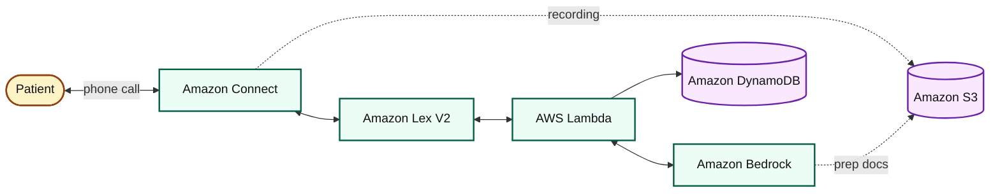
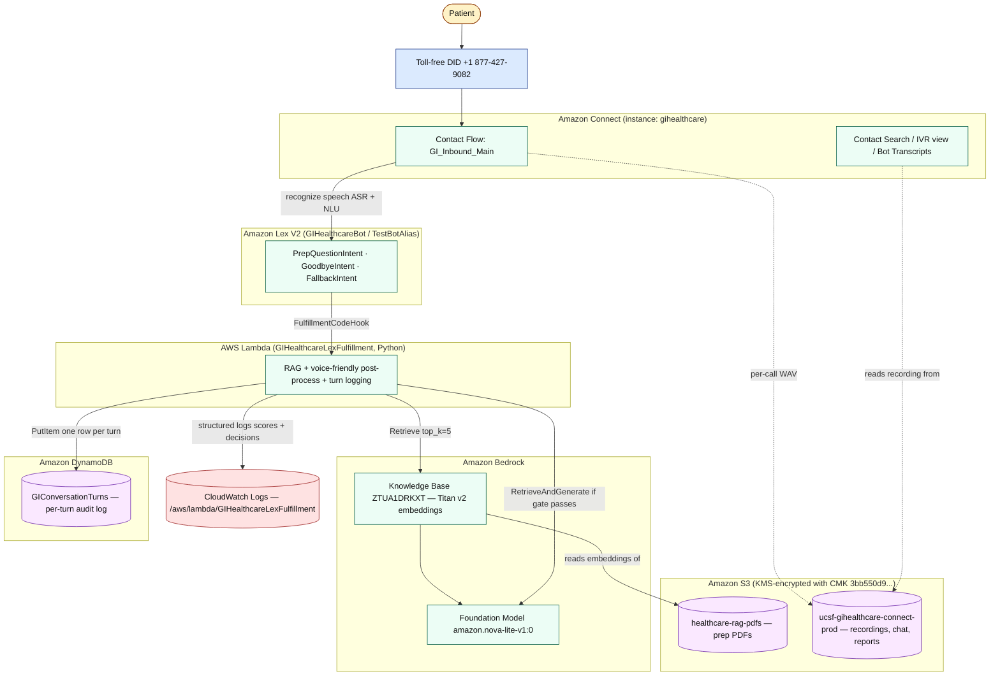
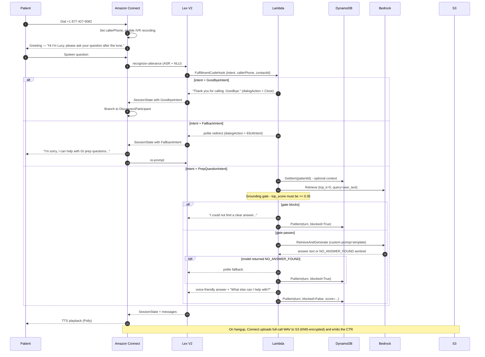

# UCSF GI Prep Voice Assistant

A HIPAA-conscious, AWS-native voice assistant ("**Lucy**") that answers patient
questions about colonoscopy and other GI procedure prep over the phone. Patients
call a toll-free number, ask their question in natural language, and Lucy
responds using only content from approved UCSF prep documents.

- **Production region:** `us-east-1`
- **AWS account:** `642058032951`
- **Connect instance alias:** `gihealthcare`
- **Toll-free number:** `+1 877-427-9082`

---

## Table of contents

1. [High-level overview](#high-level-overview)
2. [Architecture diagram](#architecture-diagram)
3. [Per-call sequence](#per-call-sequence)
4. [Component inventory](#component-inventory)
5. [Storage layout](#storage-layout)
6. [Conversation logging schema](#conversation-logging-schema)
7. [Configuration knobs](#configuration-knobs)
8. [Operational guarantees](#operational-guarantees)
9. [Language support](#language-support)
10. [Patient information collection](#patient-information-collection)
11. [Repository layout](#repository-layout)
12. [Known limitations](#known-limitations)

---

## High-level overview



**In one sentence:** a patient calls **Amazon Connect**, **Amazon Lex** understands the question, **AWS Lambda** answers it from approved UCSF prep documents using **Amazon Bedrock**, while every turn is logged to **DynamoDB** and the call recording lands in **S3**.

---

## Architecture diagram



**What `GI_Inbound_Main` does, in order:**

1. Set `callerPhone` contact attribute from `$.CustomerEndpoint.Address`.
2. Set recording + analytics behavior (`IVRRecordingBehavior=Enabled`, Contact Lens PostContact + redaction).
3. Play greeting — *"Hi I'm Lucy, welcome to the Gastrointestinal procedure assistant."*
4. **Language gate (`GI_Lang_Gate`)** — DTMF prompt *"For English, press 1. Para español, oprima 2."* Branches by digit; timeout / invalid input defaults to English so a non-touch-tone caller is never stranded.
5. **Per-language setup** — three blocks per branch wire Polly + Lex + flow attributes for the chosen language:
   - `GI_Set_Voice_{EN,ES}` (`UpdateContactTextToSpeechVoice`) — Polly voice (Danielle / Lupe, both neural).
   - `GI_Set_Lang_{EN,ES}` (`UpdateContactData`) — contact `LanguageCode` (`en-US` / `es-US`); Lex picks the matching locale automatically.
   - `GI_Set_Attrs_{EN,ES}` (`UpdateContactAttributes`) — `langCode` (`en` / `es`, forwarded to Lambda as a Lex session attribute) plus every operator-visible string used downstream (`goAheadMsg`, `noInputMsg`, `defaultRetryMsg`, `fallbackMsg_1`, `fallbackMsg_2`, `goodbyeMsg`, the three collection prompts `namePrompt` / `datePrompt` / `timePrompt`, and the three `_display` placeholders so a skipped slot reads naturally in the confirmation playback). Every message-playing block reads `$.Attributes.xxxMsg`, so adding a new locale later is "add intents → add a new attrs block".
6. **Patient information collection** — three independent Lex bot blocks (`GI_Collect_Name` → `GI_Collect_Date` → `GI_Collect_Time`), each followed by an `UpdateContactAttributes` block that saves the value (`patientName`, `procedureDate`, `procedureTime`, plus `_display` siblings for the confirmation playback). Each prompt invites the caller to either speak or **press `#` to skip**; a silent timeout also routes to skip. After the third block, `GI_Confirm_Route` reads `langCode` and plays the language-appropriate confirmation (`GI_Confirm_Info_EN` / `GI_Confirm_Info_ES`) listing all three values; press `1` accepts and continues, press `2` loops back to `GI_Collect_Name`. The caller may press `2` up to **four times** (5 total passes through name/date/time); after that, `GI_Reentry_Max` plays a brief acknowledgement (`reentryMaxMsg`) and routes to `GI_Inbound_Main` so a stubborn ASR mismatch can't trap the caller. See [Patient information collection](#patient-information-collection) for the full design + PHI-handling rationale.
7. Connect participant with the Lex bot (single block; the locale is implicit from the contact's `LanguageCode`). The Lex block's `Text` parameter reads `$.Attributes.goAheadMsg`, so the **first** Q&A turn after confirmation starts with a spoken "Go ahead." / "Adelante." (telling the caller it is now their turn to speak naturally instead of pressing DTMF). The captured `patientName` / `procedureDate` / `procedureTime` (and the `_display` siblings) are forwarded as Lex session attributes so the Lambda sees them on every turn.
8. Branch on the intent returned by Lex:
   - `GoodbyeIntent` → disconnect.
   - `FallbackIntent` → counter (`fallbackCount`) advances; 3 consecutive misses end the call with `goodbyeMsg`.
   - `PrepQuestionIntent` → `GI_Reset_Fallback` resets `fallbackCount=0` **and clears `goAheadMsg`** (to a single space — Connect rejects empty strings in `UpdateContactAttributes`), then loops back to Lex for the next question. The clear makes the spoken "Go ahead." play only on the FIRST Q&A turn; subsequent turns rely on the bot's own follow-up prompt ("What else can I help with?" / "¿En qué más puedo ayudarte?") to invite the next question, avoiding double-speaking. The fallback path is intentionally not cleared — `fallbackMsg_1` / `fallbackMsg_2` already end with concrete examples that invite a retry.

**What the Lambda does, per turn:**

1. Parse the Lex event and extract `callerPhone`, `contactId`, `langCode`, the patient-info session attributes (`patientName`, `procedureDate`, `procedureTime`, plus `_display` fallbacks), and the user utterance.
2. Build a per-call "caller-supplied context" blurb from any captured name / date / time and attach it to the **generation** prompt only — never to the retrieval query, so the grounding gate cannot be biased by injected context.
3. RAG: retrieve top-k chunks from the KB, gate on similarity score (`RETRIEVAL_MIN_SCORE`), then call `RetrieveAndGenerate` only if the gate passes.
4. Apply the language-specific prompt template (forces voice-friendly output and a strict `NO_ANSWER_FOUND` sentinel; the caller blurb is interpolated alongside the question).
5. Voice-friendly post-process (length cap, intent loopback, language-appropriate "What else can I help with?" tail).
6. Write one item to `GIConversationTurns` with the full audit fields including the captured `patientName` / `procedureDate` / `procedureTime` and `langCode`. CloudWatch logs only ever show a **first-character mask** of the name (`J***`) — full PHI lives only in DynamoDB, which is KMS-encrypted at rest.

---

## Per-call sequence

What happens for one user utterance (one "turn"):



---

## Component inventory

| Layer | Resource | Identifier / ARN | Purpose |
|---|---|---|---|
| Telephony | Toll-free DID | `+1 877-427-9082` | Patient entry point |
| Contact center | Connect instance | `0655d3a8-ea38-4bbd-a2e8-79907d12ecad` (`gihealthcare`) | IVR, recording, contact search |
| Contact center | Contact flow | `GI_Inbound_Main` (`49fa7a14-1ef7-456d-b0ee-32738a62a1be`) | Inbound flow wired to Lex |
| NLU | Lex V2 bot | `GIHealthcareBot` (`CSMSY7YKWE`) | ASR + intent classification |
| NLU | Lex V2 alias | `TestBotAlias` (`TSTALIASID`) | Connect's bound alias; Lambda hook enabled for both locales |
| NLU | Lex locales | `en_US` (built), `es_US` (built) | One bot, two locales; Connect picks per-contact via `LanguageCode` |
| NLU | Assisted NLU (Generative AI) | `generativeAISettings.runtimeSettings.nluImprovement.enabled = true` on both locales | LLM-assisted intent classification kicks in only when standard NLU confidence is below threshold (`0.4`); helps with verbose / spell-error / minimally-trained utterances. No IAM changes, no extra latency on the common path. Slot resolution improvement is a separate optional feature that requires an explicit Bedrock model ARN and is not enabled. |
| NLU | Q&A intents | `PrepQuestionIntent`, `GoodbyeIntent`, `FallbackIntent` (×2 locales) | Q&A loop. Lambda FulfillmentCodeHook on `PrepQuestionIntent` + `GoodbyeIntent`; `FallbackIntent` does **not** invoke Lambda (intentional — see incident note in [Language support](#language-support)) |
| NLU | Collection intents | `CollectNameIntent`, `CollectDateIntent`, `CollectTimeIntent` (×2 locales) | Per-call patient context capture. **Lambda fulfillment hook enabled** on all six (no RAG, no Bedrock — see `_handle_collection_intent`). The hook copies `event.inputTranscript` into a session attribute that Connect reads back via `$.Lex.SessionAttributes.X`, because Connect contact flows don't expose `$.Lex.InputTranscript` directly. For date / time, Connect also stores the normalised `$.Lex.Slots.X` value alongside the raw transcript |
| NLU | Custom slot type | `PatientNameSlotType` (`KEDQZXYNBO` en, `BWSIXNKJGQ` es) | `OriginalValue` resolution; lets Lex ASR-transcribe any name including non-English ones that the closed `AMAZON.FirstName` dictionary would reject |
| Compute | Lambda | `GIHealthcareLexFulfillment` | Fulfillment + RAG + DDB logging |
| RAG | Bedrock KB | `ZTUA1DRKXT` | Titan-v2 embeddings over UCSF prep PDFs |
| RAG | Foundation model | `amazon.nova-lite-v1:0` | Answer generation |
| Data | DynamoDB | `GIPatients` | Patient context lookup by `patientId` |
| Data | DynamoDB | `GIConversationTurns` | Per-turn audit log |
| Storage | S3 | `healthcare-rag-pdfs` | KB source documents |
| Storage | S3 | `ucsf-gihealthcare-connect-prod` | Recordings, chat, reports |
| Crypto | KMS CMK | `3bb550d9-5aa7-4fc7-9785-5df6610f5648` | Encrypts S3 + Connect artifacts |
| Observability | CloudWatch Logs | `/aws/lambda/GIHealthcareLexFulfillment` | Retrieval scores, gate decisions, per-turn logs |

### Connect instance attributes that matter

| Attribute | Value | Why |
|---|---|---|
| `CONTACT_LENS` | `true` | Enables Contact Lens (used if the call ever transfers to a human agent) |
| `BOT_MANAGEMENT` | `true` | Lets Connect manage the Lex bot |
| `ENABLE_BOT_ANALYTICS_AND_TRANSCRIPTS` | `true` | Surfaces Lex bot interactions on the Contact Details page |
| `AUTOMATED_INTERACTION_LOG` | `true` | Renders the **Automated Interaction (IVR)** view on the Contact Details page for IVR-only contacts |
| `CONTACTFLOW_LOGS` | `true` | Per-block flow logs in CloudWatch when the Set logging behavior block fires |

---

## Storage layout

S3 bucket `ucsf-gihealthcare-connect-prod` (KMS-encrypted with CMK `3bb550d9-…`, versioned, public access blocked, TLS-only, KMS-only PutObject):

```
ucsf-gihealthcare-connect-prod/
├── CallRecordings/
│   └── ivr/
│       └── yyyy/mm/dd/
│           └── <contactId>_<yyyymmdd>T<HHMM>_UTC.wav
├── ChatTranscripts/                  (reserved for future chat channel)
└── Reports/                          (scheduled report exports)
```

S3 bucket `healthcare-rag-pdfs`: source PDFs ingested by the Bedrock KB.

---

## Conversation logging schema

Every Lambda invocation writes exactly one item to `GIConversationTurns`:

| Field | Type | Source | Example |
|---|---|---|---|
| `sessionId` | S (partition key) | Lex `sessionId` (equals Connect `contactId` for live calls) | `00000000-0000-0000-0000-000000000000` |
| `turnId` | S (sort key) | `createdAt-ULID` | `2026-05-18T21:14:24Z-f0c86297-…` |
| `createdAt` | S | UTC timestamp | `2026-05-18 21:14:24` |
| `intent` | S | Resolved Lex intent | `PrepQuestionIntent` |
| `userText` | S | Raw user utterance from Lex | `"what should i be doing for the procedure"` |
| `botText` | S | What Lucy actually said | `"You should start your bowel prep by..."` |
| `callerPhone` | S | Set by flow from `$.CustomerEndpoint.Address` | `+15555550100` |
| `patientId` | S | Optional, from session attrs (legacy DDB lookup, currently disabled) | `demo-001` |
| `contactId` | S | Connect contact ID for traceability | `00000000-…` |
| `retrievalTopScore` | N | Top similarity from Bedrock Retrieve | `0.4576` |
| `groundingBlocked` | BOOL | `True` if gate refused or model emitted NO_ANSWER_FOUND | `false` |
| `langCode` | S | Caller-selected language (`en` / `es`) | `en` |
| `patientName` | S | Caller-supplied name from the collection step (omitted if caller skipped) | `Tejodhay` |
| `procedureDate` | S | Caller-supplied procedure date — Lex-normalised ISO when possible, raw transcript otherwise (omitted if caller skipped) | `2026-05-22` |
| `procedureTime` | S | Caller-supplied procedure time — Lex-normalised `HH:MM` when possible, raw transcript otherwise (omitted if caller skipped) | `09:00` |

This is the **system of record** for every turn — richer than what the Connect console surfaces, and the basis for QA, evaluation, and PII reviews. Because the caller-supplied name is PHI, the same row stored here is never written in clear to CloudWatch — see the redaction note in [Patient information collection](#patient-information-collection).

---

## Configuration knobs

All tunable without code redeploy via Lambda environment variables on `GIHealthcareLexFulfillment`:

| Env var | Current value | Effect |
|---|---|---|
| `KNOWLEDGE_BASE_ID` | `ZTUA1DRKXT` | Which Bedrock KB to query |
| `MODEL_ID` | `amazon.nova-lite-v1:0` | Foundation model for generation |
| `PATIENT_TABLE_NAME` | `GIPatients` | Patient context table |
| `CONVERSATION_TABLE_NAME` | `GIConversationTurns` | Audit log table |
| `STRICT_GROUNDING` | `true` | Master switch for the RAG grounding gate |
| `RETRIEVAL_TOP_K` | `5` | How many chunks to retrieve |
| `RETRIEVAL_MIN_SCORE` | `0.35` | Gate threshold — anything below returns the polite fallback before calling the LLM |

The grounding gate is the most important knob: too high and you reject legitimate ASR-mangled questions; too low and the model is asked to answer when no chunk is truly relevant. `0.35` was tuned against this KB after observing real ASR scores in the 0.37–0.38 band for borderline phone-number questions.

---

## Operational guarantees

What you can rely on, end-to-end:

1. **The bot never invents medical content.** Two-layer safety: the grounding gate filters by similarity score before the LLM is invoked, and the LLM's custom prompt template contractually returns `NO_ANSWER_FOUND` if the retrieved chunks don't actually answer the question. Either layer triggers the same polite fallback.
2. **Every turn is auditable.** `GIConversationTurns` holds the user text, bot text, intent, retrieval score, gate decision, caller phone, and contact ID, joinable to the Connect CTR.
3. **Recordings are HIPAA-grade encrypted at rest.** S3 CMK encryption is enforced by bucket policy (Deny on non-KMS PutObject), TLS-only access (Deny on insecure transport), public access blocked.
4. **Conversation flows are multi-turn.** The bot keeps the session open with `dialogAction.type = ElicitIntent` after every prep answer and only closes on explicit goodbye.
5. **Logging failures cannot break a call.** `_log_conversation_turn` swallows DDB errors and continues so a logging hiccup never disconnects a patient mid-conversation.
6. **Bilingual end-to-end with a single Knowledge Base.** Caller picks English or Spanish via DTMF; the same retrieval + grounding + Lambda code path serves both, with language-specific prompts, strings, and Polly voice — see [Language support](#language-support).
7. **Per-call patient context is opt-in and gracefully skippable.** Caller name / procedure date / procedure time are collected up-front via three independent Lex blocks; any (or all) can be skipped by silence or `#` and the call still continues. Captured values are confirmed back to the caller before Q&A starts, with up to **four re-entry attempts** allowed before the flow automatically proceeds with whatever was captured.
8. **PHI redaction in operational logs.** Caller name is masked to first-character + `***` in CloudWatch (`J***`); only the KMS-encrypted DynamoDB audit table holds the full value. Operators debugging from CloudWatch never see patient names in clear.
9. **Lex V2 Assisted NLU is enabled in Fallback mode.** Standard NLU runs on every utterance; an LLM-assisted rescue invokes a Bedrock model only when the standard NLU confidence falls below `nluIntentConfidenceThreshold = 0.4` (or routes to `FallbackIntent`). Common-path turns see no added latency. See [Generative AI compliance posture](#generative-ai-compliance-posture).

### Generative AI compliance posture

Two AWS-managed generative-AI features touch caller utterances and therefore deserve explicit compliance attention:

| Feature | Where | What it sees | Why it matters |
|---|---|---|---|
| Lex V2 Assisted NLU (`nluImprovement`) | Both locales, runtime only, Fallback mode | The caller's transcribed utterance text on **low-confidence turns only** | AWS-managed; uses Amazon Bedrock under the hood. Caller utterances may contain PHI (e.g. *"my procedure is May 22 at 9 AM"*). |
| Bedrock Knowledge Base `retrieve_and_generate` | Q&A turns (Lambda → Bedrock) | The caller's question text + the patient-info blurb (name / date / time) | Long-standing core RAG path; data sits in `us-east-1`. |

**Cross-region inference for Assisted NLU.** Per the AWS Lex V2 docs ([`assisted-nlu.html`](https://docs.aws.amazon.com/lexv2/latest/dg/assisted-nlu.html)):

> *"When you enable this feature, your data might be processed across AWS Regions. For more information on Cross-Region Inference, see [Cross-Region Inference for Amazon Bedrock](https://docs.aws.amazon.com/bedrock/latest/userguide/cross-region-inference.html)."*

Practically this means a single Assisted-NLU rescue invocation originating in `us-east-1` may be routed to another US commercial region (typically `us-east-2` or `us-west-2`) for capacity. For UCSF's HIPAA posture:

- Amazon Bedrock is HIPAA-eligible in all US commercial regions, and our AWS BAA covers the full set, so PHI in cross-region inference traffic stays within BAA scope.
- CloudWatch and CloudTrail logs for Lex stay in `us-east-1`. Cross-region Bedrock invocations are not surfaced in our local CloudWatch but are accounted for in Bedrock's own audit logs.
- If single-region residency ever becomes a hard requirement, Assisted NLU can be disabled on either locale via `update-bot-locale` setting `generativeAISettings.runtimeSettings.nluImprovement.enabled = false`, followed by a rebuild. Doing so reverts to standard NLU only — no Lambda or Connect-flow changes are needed.

---

## Language support

The assistant currently supports **English (en-US)** and **Spanish (es-US)**. Language is chosen by the caller via the `GI_Lang_Gate` DTMF prompt (press 1 / press 2) right after the greeting.

### How the language threads through the stack

| Layer | Where the language lives |
|---|---|
| Connect contact | Polly voice via `UpdateContactTextToSpeechVoice` (Danielle for `en`, Lupe for `es`, both neural), language via `UpdateContactData.LanguageCode` (`en-US` / `es-US`). Lex auto-selects the matching locale from the bot alias's enabled locales — no `LocaleId` is set on the Lex bot block. |
| Lex V2 | Bot has two locales (`en_US` + `es_US`), each with its own `PrepQuestionIntent` and `GoodbyeIntent` sample utterances. `FallbackIntent` exists in both but is deliberately **not** wired to Lambda (see PHI incident note below). The same Lambda ARN is registered as the code hook for both locales. |
| Lambda | `langCode` (`en` / `es`) is passed as a Lex session attribute and read on every turn. `LANG_STRINGS` and `PROMPT_TEMPLATES` dicts (in `lambda_handler.py`) hold all caller-visible text and the Bedrock prompt for each language. Unknown `langCode` values fall back to English so a misconfigured flow can never strand a caller. |
| Bedrock | Single English Knowledge Base (`ZTUA1DRKXT`); cross-lingual retrieval works because Titan v2 embeddings are multilingual. The Spanish prompt asks Nova to translate the answer to Spanish from the English source chunks at inference time. |

### MVP gap: cross-lingual generation vs. clinically-translated Spanish source

The Spanish answers today are produced by asking Bedrock Nova to **translate the English UCSF prep content into Spanish at inference time**. This is acceptable for the MVP/demo but is **not** production-ready for clinical use because:

- Translation accuracy of medical terminology (e.g., "clear liquids", "GoLYTELY dosing schedule", "split-dose prep") is not formally validated.
- The retrieval gate scores typically run ~0.05 lower for Spanish queries against English chunks, so a legitimate Spanish prep question can occasionally fall under the grounding threshold (currently 0.35).
- No clinical reviewer has signed off on the Spanish phrasing.

**Production path** (do all of these before turning Spanish on for real patients):

1. Ingest a **clinically-translated Spanish source PDF** (UCSF Spanish patient prep instructions) into either a separate KB or a language-tagged data source within the same KB.
2. Switch the Spanish prompt template from "translate from English" to "answer in Spanish from Spanish source chunks".
3. Have a native-Spanish reviewer validate the sample utterances in `es_US` (`PrepQuestionIntent`, `GoodbyeIntent`) — current set is a reasonable initial draft, not validated.
4. Re-tune `RETRIEVAL_MIN_SCORE` per locale (or per-locale gate) once the Spanish KB exists.

### PHI incident note for the language layer — `FallbackIntent` is deliberately Lambda-free

An earlier iteration wired `FallbackIntent` to the same Lambda hook so we could play a custom message on silence. Lex maps empty / silent audio to `FallbackIntent`, the Lambda then ran RAG on an empty utterance, the grounding gate let a marginal chunk through, and the model produced a **personalized prep schedule using a hardcoded demo `patientId`** that no caller had ever asked about. We reverted the hook on `FallbackIntent` (both locales), removed the hardcoded `patientId` from the contact flow, unset `PATIENT_TABLE_NAME` env var, and added an explicit empty-utterance guard in Lambda. The Connect-side `fallbackCount` counter (with 3 strikes before disconnect) handles all "I didn't understand" UX now. **Do not re-enable Lambda invocation on `FallbackIntent` without re-doing this entire safety review.**

---

## Patient information collection

After the language gate and before the Q&A loop, the flow collects three pieces of per-call patient context — **first name**, **procedure date**, **procedure time** — so the Bedrock prompt can personalise timing-sensitive answers ("when do I start my prep" → "Tejodhay, you start your prep one night before your procedure at 6 PM"). The whole stage is opt-in and can be skipped per-field, so a caller who doesn't have the info handy (or simply doesn't want to share) is never blocked from asking their question.

### Design — three independent Lex blocks, not one multi-slot intent

We considered a single `CollectPatientInfoIntent` with three slots, but chose **three separate single-slot intents** (`CollectNameIntent`, `CollectDateIntent`, `CollectTimeIntent`, in both `en_US` and `es_US`) for these reasons:

| Concern | One intent + three slots | **Three intents (chosen)** |
|---|---|---|
| Independence | If slot 2 (date) gets confused, the intent can abort and lose slot 1 (name) | Each block is self-contained; one failure doesn't drop the others |
| Graceful skip | Requires intent-level "skip slot" handling | Skip is just the block's timeout / `NoMatchingError` error path → next block |
| Per-piece tuning | One global timeout | Date can have a longer timeout than name (currently all 10s, easy to differentiate) |
| Save to Connect attrs | Slot values only readable inside the Lex block's downstream | Each block saves immediately into `$.Attributes.X` for the rest of the call |
| Cost | Fewer intents to maintain | 6 intents (3 × 2 locales) + 1 custom slot type per locale |

The trade-off is real (three Lex round-trips add ~3 s of upfront latency vs. one), but the robustness win on a flow that runs ahead of every clinical Q&A pays for itself.

### Why AMAZON.FirstName alone does not fix NLU routing for names

Changing the `patientName` slot type to `AMAZON.FirstName` improves ASR accuracy and slot-value resolution for common names once an intent is matched. It does **not** change how NLU routes the caller's initial utterance to an intent. In a fresh Lex session a bare name like "Tejodhay" or even "John" scores below the NLU confidence threshold and routes to `FallbackIntent`, so the slot is never elicited and the fulfillment hook never fires.

`AMAZON.Date` and `AMAZON.Time` work reliably because those types have built-in grammar engines at the NLU layer that recognise date/time expressions. No equivalent engine exists for free-text names.

### Solution 2 — FallbackIntent guard with `collectionMode` session attribute

The design uses three coordinated components:

1. **Connect flow** — `GI_Collect_Name` passes `collectionMode=name` as a Lex session attribute. Its intent-result `Conditions` are widened to route **both** `CollectNameIntent` and `FallbackIntent` to `GI_Save_Name`. `GI_Inbound_Main` explicitly passes `collectionMode=` (empty string) to prevent the flag from bleeding into the Q&A phase.

2. **Lex** — `FallbackIntent` in both locales has `fulfillmentCodeHook.enabled=true, active=true`. This fires Lambda for every `FallbackIntent` result.

3. **Lambda** (`_handle_collection_intent` / FallbackIntent guard in `lambda_handler`) — when `intent=FallbackIntent` and `collectionMode=name`, the handler redirects to `_handle_collection_intent("CollectNameIntent")`, writing the raw transcript to `patientNameRaw` and immediately clearing `collectionMode` so the flag cannot affect subsequent turns. When `intent=FallbackIntent` and `collectionMode` is absent or empty (Q&A phase), Lambda returns `Close` with no messages and lets the Connect flow's `GI_Check_Fallback` block handle the fallback counter and spoken message — no RAG, no Bedrock call, no double speech.

**Call flow for name capture:**
```
Connect: GI_Collect_Name (LexSessionAttr: collectionMode=name)
  → Lex plays prompt, listens
  → Caller: "Tejodhay"
  → NLU: FallbackIntent (expected — no grammar for bare names)
  → FulfillmentCodeHook fires → Lambda
  → Lambda: collectionMode=name → _handle_collection_intent("CollectNameIntent")
      writes patientNameRaw="Tejodhay", clears collectionMode=""
      returns Close / Fulfilled
  → Lex returns to Connect with IntentName=FallbackIntent, state=Fulfilled
  → Connect Condition: FallbackIntent → GI_Save_Name
  → GI_Save_Name: patientName = $.Lex.SessionAttributes.patientNameRaw = "Tejodhay"
```

**PHI guardrail preserved:** the FallbackIntent hook during the Q&A phase (`GI_Inbound_Main`) has `collectionMode=""` so the guard is never entered. There is no path from the collection guard to RAG or Bedrock.

### Why each collection block needs a Lambda fulfillment hook

There were two specific obstacles to capturing patient data straight out of Lex's slot output that drove the current design:

1. **Connect contact flows don't expose `$.Lex.InputTranscript`.** The supported Lex paths are `$.Lex.IntentName`, `$.Lex.IntentConfidence.Score`, `$.Lex.AlternativeIntents.X.*`, `$.Lex.Slots.{name}`, `$.Lex.SessionAttributes.{key}`, `$.Lex.SentimentResponse.*`, and `$.Lex.DialogState` — see the AWS docs page `connect-attrib-list.html` for the full list. `InputTranscript` is **not** in it; if you reference it in an `UpdateContactAttributes` block it silently resolves to an empty string. The first cut of Step 3 hit this directly: the date / time slots worked, but the `_display` siblings (which were meant to hold the caller's raw natural phrasing for the confirmation playback) were all empty, and the entire name capture was empty too. The confirmation playback sounded silent in the slots where values should have been.
2. **Lex NLU classifies short, free-text names unreliably.** `"my name is John"` cold-starts to `FallbackIntent` in our tests because the `"{patientName}"` pattern is too generic to outscore the other intents in the locale, so even `$.Lex.Slots.patientName` would have been blank a meaningful fraction of the time.

The fix is a tiny fulfillment hook (`_handle_collection_intent` in `lambda_handler.py`) wired to all six Step-3 collection intents (en + es). Each hook reads `event.inputTranscript` — which the Lambda **does** receive even when Connect can't — and writes it into a Lex session attribute (`patientNameRaw` / `procedureDateRaw` / `procedureTimeRaw`). The Save blocks then read it back via the well-supported `$.Lex.SessionAttributes.X` path. For the name intent only, the hook also strips conversational prefixes (`"my name is"`, `"me llamo"`, `"call me"`, …) via `_normalize_name` so the confirmation reads "I have your name as **Tejodhay**" instead of "as **my name is Tejodhay**".

A silence- or `#`-skip writes the language-appropriate placeholder (`"not provided"` / `"no proporcionado"`) into the session attribute so the confirmation playback stays grammatical, and `_extract_caller_info` ignores those placeholders so a skipped slot never leaks into the Bedrock prompt as if it were the caller's real name.

To stop a misclassified utterance (the FallbackIntent case) from overwriting good defaults, each Collect block has a single `Conditions` entry — `IntentName == CollectXIntent` → Save_X — and its default `NextAction` skips straight to the next Collect block. Only a clean intent match (which means the Lambda hook ran and the session attribute is populated) triggers the Save. For date and time we additionally keep `$.Lex.Slots.procedureDate` / `$.Lex.Slots.procedureTime` as the **data** field (normalised ISO, fed to Bedrock) and use `$.Lex.SessionAttributes.procedureDateRaw` / `procedureTimeRaw` only for the `_display` field (raw transcript, fed to Polly for natural playback).

### Confirmation playback + bounded re-entry loop

After the third capture, `GI_Confirm_Route` reads `langCode` and routes to either `GI_Confirm_Info_EN` or `GI_Confirm_Info_ES`. The block reads back all three values inline (`$.Attributes.patientName_display`, `…_display` siblings for raw, human-friendly date / time) and asks the caller to press `1` to accept or `2` to re-enter.

`reentryCount` (seeded to `"0"` in `GI_Set_Attrs_{EN,ES}`) tracks how many times the caller has chosen re-entry. The chain is:

| `reentryCount` | Press 2 → | New value | Next |
| --- | --- | --- | --- |
| `0` (initial) | `GI_Mark_Reentry` | `1` | `GI_Collect_Name` |
| `1` | `GI_Mark_Reentry_2` | `2` | `GI_Collect_Name` |
| `2` | `GI_Mark_Reentry_3` | `3` | `GI_Collect_Name` |
| `3` | `GI_Mark_Reentry_4` | `4` | `GI_Collect_Name` |
| `4` | `GI_Reentry_Max` plays `$.Attributes.reentryMaxMsg` ("Okay, let's proceed with the information we have." / "Esta bien, continuemos con la informacion que tenemos.") | unchanged | `GI_Inbound_Main` |

That gives the caller up to four re-entry attempts (5 total passes through name/date/time) before the flow auto-proceeds. The cap prevents a stubborn ASR mismatch from trapping the caller in an infinite confirm-loop. The trailing "Go ahead." prompt is left to `GI_Inbound_Main` so `reentryMaxMsg` deliberately does NOT include it (avoids double-speaking). The "Go ahead." prompt is spoken **only on the first Q&A turn** — `GI_Reset_Fallback` clears `goAheadMsg` after each successful `PrepQuestionIntent` so subsequent turns rely on the bot's own follow-up prompt ("What else can I help with?") to invite the next question.

Skipped fields show as `"not provided"` / `"no proporcionado"` in the playback (seeded as defaults in `GI_Set_Attrs_{EN,ES}`), which keeps the confirmation grammatical without conditional message blocks.

### Lambda integration — Stage 2 only, never Stage 1

`_extract_caller_info` reads `patientName` / `procedureDate` / `procedureTime` from the Lex session attributes (falling back to the `_display` siblings for date and time when the normalised slot was empty, and ignoring the `not provided` / `no proporcionado` placeholders so a skipped slot never leaks into the prompt). The output is passed to `_build_caller_info_blurb` and appended to the Bedrock generation prompt as a structured English block:

```
Caller-supplied context (apply only if the patient question is about timing or personalised scheduling):
- Patient name: Tejodhay
- Procedure date: 2026-05-22
- Procedure time: 09:00
```

The blurb is interpolated only into the Stage-2 `RetrieveAndGenerate` call, never into the Stage-1 `Retrieve` query, so it cannot pollute the grounding-gate similarity score (this is the same safeguard the legacy `_get_patient_context` DDB lookup used).

### PHI handling

| Where | Stored value | Why |
|---|---|---|
| DynamoDB `GIConversationTurns` (audit log) | Full `patientName`, `procedureDate`, `procedureTime` | KMS-encrypted at rest, joinable to the Connect CTR, system of record for QA and PII reviews |
| CloudWatch `/aws/lambda/GIHealthcareLexFulfillment` | `name=J***` (first character + three asterisks), `date=` and `time=` in clear | Operators reading logs see enough to spot patterns ("recurring `J***` from same phone") without exposing the full PHI; date / time alone are not direct identifiers under HIPAA Safe Harbor |
| Bedrock prompt | Full caller context for the duration of one `RetrieveAndGenerate` call | Bedrock processes the request without persistence; nothing is retained on the model side |
| Connect contact attributes | Full values for the duration of the call | Cleared when the contact ends |

The redaction lives in `_redact_name` and `_log_conversation_turn` in `lambda_handler.py`. Anyone changing those needs to keep the asymmetry: **CloudWatch redacted, DynamoDB clear.** Inverting that would either lose audit fidelity or leak PHI to ops dashboards.

---

## Repository layout

```
UCSF-AWS-ContactCenter/
├── README.md                          # this file
├── aws_voice_assistant_plan.md        # 4-week build plan / project roadmap
├── lambda_handler.py                  # Fulfillment Lambda source (source of truth)
├── UCSF-diagram.pdf                   # Original architecture intent (input doc)
├── _aws_assets/                       # JSON payloads used to configure AWS
│   ├── bot_update.json, bot_revert.json
│   ├── lex_alias_*.json
│   ├── connect_ctr_storage.json       # (not currently applied)
│   ├── flow_v3_with_logging.json      # (not currently applied)
│   ├── kms_policy_*.json
│   ├── bucket_policy_*.json
│   └── ...
└── _test_events/                      # JSON payloads for direct invocations + CLI tests
    ├── valid_gi.json, offtopic.json, goodbye.json, nearmiss.json
    ├── verify_thr1.json, verify_thr2.json
    ├── flow_active.json               # last-known-good Connect flow content
    └── ...
```

---

## Known limitations

| Limitation | Reason | Mitigation |
|---|---|---|
| **Standard Contact Lens for voice does not run on these contacts** (sentiment, redacted transcript JSON, talk-time analytics) | Per AWS docs, Contact Lens conversational analytics for voice requires both agent **and** customer audio streams. Lucy handles the entire call in IVR; no human agent ever joins. | The day calls start transferring to a human agent queue, Contact Lens will activate automatically — the flow block is already configured for it. For IVR-only audit, `GIConversationTurns` is the system of record. |
| **No outbound reminder/push flow yet** | Not built in this phase. Original PDF design includes EventBridge + Pinpoint + Outbound Campaigns. | Tracked in `aws_voice_assistant_plan.md`. |
| **No patient verification before answering** | `callerPhone` is captured but not yet matched against `GIPatients`, and the per-call info collected in [Patient information collection](#patient-information-collection) is taken at the caller's word — no record-of-truth crosscheck. | Phase 2 — verify caller phone (and optionally the collected name + date) against `GIPatients` before unlocking any genuinely PHI-specific answers. The current personalisation only re-styles generic prep guidance using the caller-supplied name and timing; it does not surface stored patient records. |
| **Confirmation playback cannot fix individual fields** | The "press 2 to re-enter" path restarts all three collection blocks. There's no "fix just the date" branch. | Acceptable for the current scope (caller still gets up to four re-entries per call). If callers complain, add per-field re-entry routing (3 Compare blocks on the confirmation response) — but every added branch hardens the flow surface area to test. |
| **Bot uses `TestBotAlias` (DRAFT)** | Convenient during build-out. | Cut a numbered Lex bot version and a `Production` alias before go-live. |
| **Spanish answers translate English source at inference time** | No clinically-translated Spanish prep PDF in the Knowledge Base yet. | See [Language support](#language-support) — ingest a Spanish source PDF + clinical review before opening Spanish to real patients. Bot answers are currently best-effort translations. |
