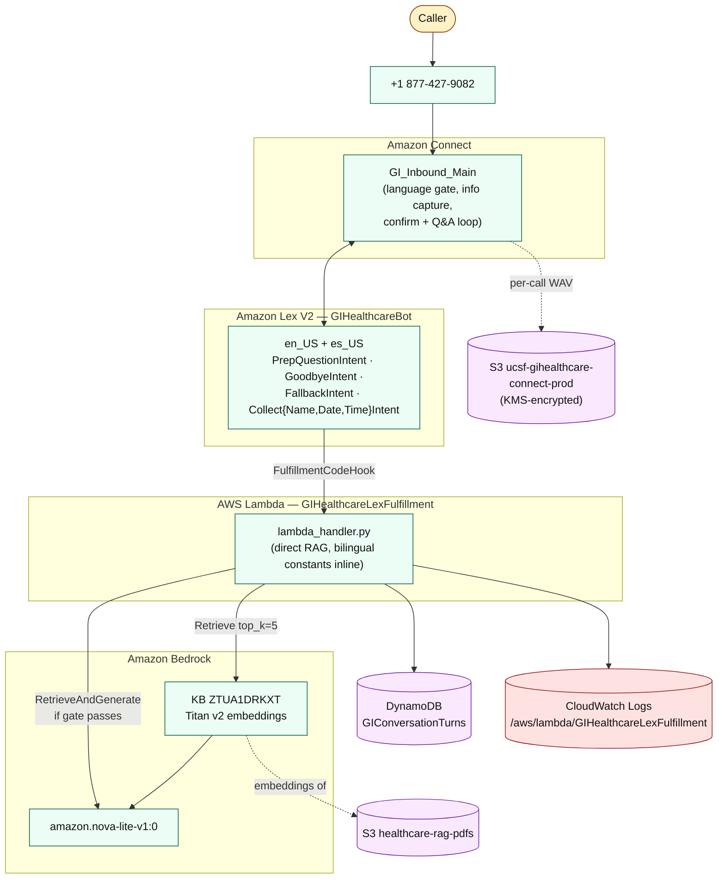
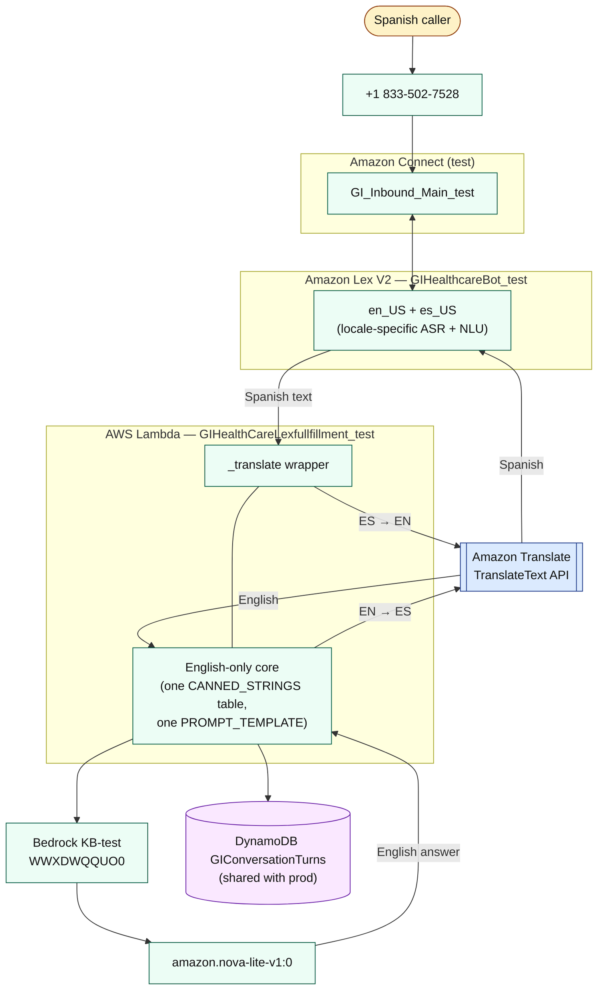
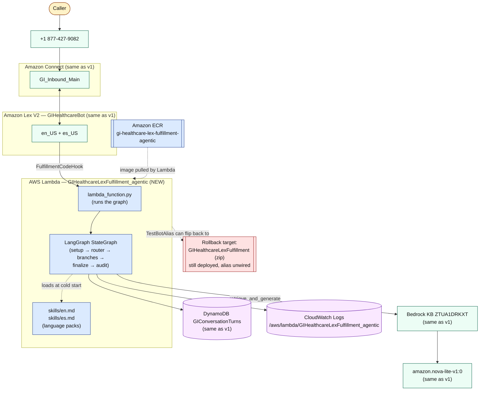

# UCSF GI Prep Voice Assistant — Handover Document

A HIPAA-conscious AWS-native voice assistant ("**Lucy**") that answers
patient questions about colonoscopy and other GI procedure prep over the
phone. Patients call a toll-free number, ask their question in natural
language, and Lucy responds using only content from approved UCSF prep
documents.

| | |
| --- | --- |
| AWS account | `642058032951` |
| Region | `us-east-1` |
| Connect instance alias | `gihealthcare` |
| Connect instance id | `0655d3a8-ea38-4bbd-a2e8-79907d12ecad` |
| Production toll-free number | **`+1 877-427-9082`** |
| Production contact flow | `GI_Inbound_Main` (`49fa7a14-1ef7-456d-b0ee-32738a62a1be`) |
| Lex bot | `GIHealthcareBot` (`CSMSY7YKWE`) |
| Lex alias bound to Connect | `TestBotAlias` (`TSTALIASID`) |
| Lambda fulfillment (live) | `GIHealthcareLexFulfillment_agentic` (container image, arm64) |
| Lambda fulfillment (rollback target) | `GIHealthcareLexFulfillment` (zip, python 3.13) |
| Bedrock Knowledge Base | `GIHealthCareKB` (`ZTUA1DRKXT`) |
| Bedrock generation model | `amazon.nova-lite-v1:0` |
| Audit table | DynamoDB `GIConversationTurns` |
| Call recordings | S3 `ucsf-gihealthcare-connect-prod` (KMS-encrypted) |
| Source PDFs (KB) | S3 `healthcare-rag-pdfs` |

---

## Table of contents

1. [What this system does](#what-this-system-does)
2. [The three versions in this repo](#the-three-versions-in-this-repo)
3. [Repository layout](#repository-layout)
4. [Version 1 — Just-Lex](#version-1--just-lex)
5. [Version 2 — Lex + Amazon Translate](#version-2--lex--amazon-translate)
6. [Version 3 — Agentic-RAG (current production)](#version-3--agentic-rag-current-production)
7. [Operating the system](#operating-the-system)
8. [Error handling & debugging](#error-handling--debugging)
9. [Where to go next](#where-to-go-next)

---

## What this system does

In one sentence: a patient calls **Amazon Connect**, **Amazon Lex**
understands the spoken question, **AWS Lambda** answers it from approved
UCSF prep documents using **Amazon Bedrock**, every turn is logged to
**DynamoDB**, and the call recording lands in **S3**.

End-to-end the system handles:

- Bilingual entry (English / Spanish) via a DTMF language gate.
- Per-call patient information capture (first name, procedure date,
  procedure time) with graceful skip if the caller doesn't have it
  handy.
- Multi-turn Q&A grounded in the UCSF GI Knowledge Base, with a
  similarity-score gate so the bot never invents medical content.
- Safety-keyword escalation ("chest pain", "bleeding heavily") that
  short-circuits the LLM and plays a clinically-reviewed canned
  message.
- HIPAA-grade encryption of recordings and the audit log; PHI redaction
  in operational CloudWatch logs (`J***` instead of full name).

---

## The three versions in this repo

This repo contains **three implementations** of the same voice
assistant. Only one is live; the others are kept on disk for reference
and rollback.

| Version | Folder | What it is | Status |
| --- | --- | --- | --- |
| v1 | `Lex/` | First implementation. A single Python Lambda (`lambda_handler.py`) does direct RAG against Bedrock and embeds all language-specific text (English + Spanish) inline as Python dictionaries. | Frozen archive. Lambda still deployed in AWS as the **rollback target**. |
| v2 | `LexV2&AMZNTranslate/` | Alternative implementation that simplifies the Lambda core to English only and routes every non-English caller through **Amazon Translate** (ES→EN before RAG, EN→ES on the response). Lives on a separate phone number (`+1 833-502-7528`), separate Lex bot (`GIHealthcareBot_test`), separate Lambda. | Not in production. Built as a parallel A/B candidate; rejected for the reasons listed in its section below. |
| v3 | `AgenticRAG/` | Same external behavior as v1, refactored into a **LangGraph state machine** with per-language config-as-data ("skills" — markdown files with YAML frontmatter). Packaged as a Lambda container image. | **Current production.** Serves `+1 877-427-9082`. |

The same external AWS resources (Connect instance, contact flow, Lex
bot, Knowledge Base, audit table, S3 buckets) back v1 and v3 — only
the Lambda code behind the Lex alias was swapped. v2 has its own
isolated stack.

---

## Repository layout

```
UCSF-AWS-ContactCenter/
├── handover_document.md             ← you are here
├── Lex/                             ← v1 archive (frozen)
│   ├── lambda_handler.py            ← single-file Lambda with bilingual constants inline
│   ├── README.md                    ← deep-dive: per-call sequence, prompt templates, PHI policy
│   └── golytely-ucsf-standard-prep.pdf
├── LexV2&AMZNTranslate/             ← v2 experiment (not in production)
│   ├── lambda_function.py           ← English-only core + Amazon Translate wrapper
│   ├── README.md                    ← deep-dive: translation cache, test stack resource IDs
│   └── _smoke_*.json                ← sample Lex events for smoke tests
├── AgenticRAG/                      ← v3 (current production)
│   ├── lambda_function.py           ← Lambda entry point (~30 lines, runs the graph)
│   ├── agentic/                     ← LangGraph nodes, state, AWS clients, RAG / audit helpers
│   ├── skills/                      ← language packs (en.md, es.md, schema.py, loader.py)
│   ├── sample_events/               ← input fixtures (also used by parity tests)
│   ├── tests/                       ← 191 unit + smoke + parity tests
│   ├── Dockerfile + requirements.txt
│   ├── ROLLBACK.ps1                 ← one-paste rollback to v1
│   └── README.md                    ← deep-dive: build phases, graph topology, runbooks
└── *.zip                            ← deployment artifacts (gitignored)

# Not in this repo (kept on the maintenance machine only):
#   _connect_flow_snapshots/         ← timestamped JSON snapshots of
#                                      GI_Inbound_Main + one-paste rollback
#                                      scripts. AWS Connect has no built-in
#                                      versioning, so snapshot before any
#                                      flow change.
```

Each subfolder has its own README with the full technical depth. **This
document stays at a level a new engineer can read end-to-end in
20 minutes** and decide which subfolder to open next.

---

## Version 1 — Just-Lex

The first version of the assistant. Everything lives in one Python
file; all language-specific content (canned bot strings, prompt
templates, escalation keywords) sits as Python dictionaries inside
`lambda_handler.py`. RAG is direct: the Lambda calls Bedrock's
`retrieve_and_generate` API once per turn.

### Services attached to v1

| Service | Resource | What it does in v1 |
| --- | --- | --- |
| Amazon Connect | Contact flow `GI_Inbound_Main` | Answers the call, plays the greeting, runs the DTMF language gate (press 1 / press 2), runs the three patient-info collection blocks, then hands the conversation to the Lex bot for Q&A. |
| Amazon Lex V2 | Bot `GIHealthcareBot`, alias `TestBotAlias`, locales `en_US` + `es_US` | Performs speech-to-text (ASR) and intent classification on every caller turn. Intents: `PrepQuestionIntent`, `GoodbyeIntent`, `FallbackIntent`, `CollectNameIntent`, `CollectDateIntent`, `CollectTimeIntent`. |
| AWS Lambda | `GIHealthcareLexFulfillment` (Python 3.13, zip, ~14 KB) | Fulfillment handler. On every Lex turn it parses the event, retrieves chunks from the KB, checks the grounding gate, calls Bedrock to generate the answer, writes one audit row to DynamoDB, and returns the response to Lex. |
| Amazon Bedrock — Knowledge Base | `GIHealthCareKB` (`ZTUA1DRKXT`), Titan v2 embeddings | Holds the chunked + embedded UCSF prep PDFs. Vector store backs the retrieval call. |
| Amazon Bedrock — Foundation Model | `amazon.nova-lite-v1:0` | Generates the answer text from retrieved chunks using a language-specific prompt template (English template asks for English answer, Spanish template asks Nova to translate the English source on the fly). |
| Amazon DynamoDB | `GIConversationTurns` | Per-turn audit log. One row per Lex invocation with user text, bot text, intent, retrieval score, caller phone, captured patient info. |
| Amazon S3 | `healthcare-rag-pdfs` | Source PDFs ingested by the Knowledge Base. |
| Amazon S3 | `ucsf-gihealthcare-connect-prod` | Per-call WAV recordings + Contact Lens reports. KMS-encrypted, TLS-only. |
| Amazon Polly | Neural voices Danielle (`en_US`) and Lupe (`es_US`) | Text-to-speech for everything Lucy says. |
| AWS KMS | CMK `3bb550d9-…` | Encrypts S3 + Connect artifacts. |
| Amazon CloudWatch Logs | `/aws/lambda/GIHealthcareLexFulfillment` | Per-turn Lambda logs (retrieval scores, gate decisions, redacted PHI). |

### Call flow — ASCII

```
   Caller dials
+1 877-427-9082
       │
       ▼
┌────────────────────────────────────────────────────────────────────┐
│ AMAZON CONNECT  (contact flow GI_Inbound_Main)                     │
│                                                                    │
│  1. Set callerPhone, enable IVR recording                          │
│  2. Play greeting: "Hi I'm Lucy, welcome to the GI assistant"      │
│  3. Language gate (DTMF):  press 1 = English  / press 2 = Spanish  │
│  4. Per-language setup: Polly voice + Lex locale + canned strings  │
│  5. Collect NAME   ──┐                                             │
│  6. Collect DATE    ─┼─ three independent Lex blocks               │
│  7. Collect TIME   ──┘  (each can be skipped with # or silence)    │
│  8. Confirm playback: "Press 1 to continue, 2 to re-enter"         │
│  9. Hand the conversation to the Lex bot for free-form Q&A         │
└────────────────────────────────────────────────────────────────────┘
       │ (every caller turn)
       ▼
┌────────────────────────────────────────────────────────────────────┐
│ AMAZON LEX V2  (GIHealthcareBot / TestBotAlias)                    │
│  ASR (speech → text)                                               │
│  NLU (text → intent + slots)                                       │
└────────────────────────────────────────────────────────────────────┘
       │ FulfillmentCodeHook
       ▼
┌────────────────────────────────────────────────────────────────────┐
│ AWS LAMBDA  GIHealthcareLexFulfillment   (lambda_handler.py)       │
│                                                                    │
│  • Pick language strings from LANG_STRINGS[langCode]               │
│  • Build caller-info blurb (name / date / time)                    │
│  • Retrieve top-5 chunks from KB                                   │
│  • Gate: top score ≥ 0.35 ?                                        │
│       │       │                                                    │
│      yes      no  → return polite fallback                         │
│       ▼                                                            │
│  • Bedrock RetrieveAndGenerate (language-specific prompt template) │
│  • Voice-friendly post-process                                     │
│  • Write 1 row to DynamoDB GIConversationTurns                     │
│  • Return Lex response with "What else can I help with?" tail      │
└────────────────────────────────────────────────────────────────────┘
       │
       ▼
   Lex → Connect → Polly → caller hears the answer
```

### Architecture — Mermaid



### What each component does (plain language)

- **Amazon Connect** is the phone system. It answers the call, plays
  prompts, captures DTMF, records the WAV, and shuttles audio to and
  from Lex. The whole IVR — greeting, language gate, patient info
  capture, confirm playback, retry counter — is configured here as a
  visual contact flow.
- **Amazon Lex V2** is the language-understanding layer. It receives
  audio frames from Connect, transcribes them, and decides which
  *intent* the caller's words match. If the intent has a fulfillment
  code hook, Lex calls Lambda.
- **AWS Lambda** is where v1 puts all of its business logic. One Python
  file holds the per-language strings (`LANG_STRINGS`), the prompt
  templates (`PROMPT_TEMPLATES`), the escalation keyword lists, the
  helpers that extract caller info from the event, and the call to
  Bedrock.
- **Amazon Bedrock Knowledge Base** is the RAG retrieval layer. The
  source PDFs in S3 are chunked + embedded once at ingest time;
  retrieval returns the top-k most-similar chunks for any query.
- **Amazon Bedrock foundation model** (Nova-Lite) generates the actual
  spoken answer, given the retrieved chunks and the prompt template
  for the caller's language.
- **DynamoDB** is the audit log. Every turn becomes one row — caller
  phone, contact ID, user text, bot text, retrieval score, language,
  captured patient info. Joinable to Connect's contact record.
- **CloudWatch Logs** has the per-turn engineering logs (with PHI
  redacted to `J***`) for debugging.

For the full technical depth — slot types, intent descriptions,
grounding-gate tuning, the PHI incident note for `FallbackIntent`, the
re-entry loop design — see **`Lex/README.md`**.

---

## Version 2 — Lex + Amazon Translate

### Why we built it

The goal was to make adding a new language as cheap as possible. The
v1 Lambda hard-codes a per-language string table (`LANG_STRINGS["en"]`,
`LANG_STRINGS["es"]`), a per-language prompt template
(`PROMPT_TEMPLATES["en"]`, `PROMPT_TEMPLATES["es"]`), per-language
prefix-strip regexes for the name slot, and per-language escalation
keyword tuples. Every new language doubled the surface area to write,
clinically review, and maintain.

v2 asks the question: *what if the Lambda were English-only, and
Amazon Translate did all the translation for non-English callers?*
Then adding a new language reduces to "add a new locale to the Lex
bot and a branch to the Connect language gate" — the Lambda code
doesn't change at all.

### Services attached to v2

v2 was built as a fully isolated parallel stack on a separate phone
number, so it could be A/B tested without risking the production
hotline.

| Service | Resource | What it does in v2 |
| --- | --- | --- |
| Amazon Connect | Contact flow `GI_Inbound_Main_test` (`66ec0ac9-a804-4527-9490-e0a066798a78`), phone `+1 833-502-7528` | Functionally identical IVR to prod, but pointed at the test Lex bot + Lambda. |
| Amazon Lex V2 | Bot `GIHealthcareBot_test` (`4XWU77TLEP`), alias `TestBotAlias`, locales `en_US` + `es_US` | ASR + NLU. **Lex locales are still language-specific** because Transcribe (the ASR under Lex) and Polly (the TTS) do not perform translation — only the application core can be made language-agnostic. |
| AWS Lambda | `GIHealthCareLexfullfillment_test` (Python 3.13, zip) | English-only core. One `CANNED_STRINGS` table, one English `PROMPT_TEMPLATE`, plus an Amazon Translate wrapper (`_translate`). |
| **Amazon Translate** | API service, `TranslateText` | Translates the caller utterance ES→EN before RAG, then translates the answer EN→ES on the way back. Pure API call, no console resources. HIPAA-eligible, no data persistence. |
| Amazon Bedrock — Knowledge Base | `GIHealthCareKB-test` (`WWXDWQQUO0`) | Separate KB instance to keep the test stack isolated. Same source PDFs. |
| Amazon Bedrock — Foundation Model | `amazon.nova-lite-v1:0` | Same model as v1. |
| Amazon DynamoDB | `GIConversationTurns` | Shared with prod; v2 rows distinguishable by `botId`. |

### Call flow — ASCII (Spanish caller)

```
   Spanish caller dials +1 833-502-7528
       │
       ▼
   AMAZON CONNECT  (GI_Inbound_Main_test)
   Polly Lupe (Spanish neural)
   Language gate → Spanish branch
       │
       ▼
   AMAZON LEX  (GIHealthcareBot_test, es_US locale)
   Spanish ASR + Spanish NLU → intent
       │ FulfillmentCodeHook (Spanish text)
       ▼
   ┌────────────────────────────────────────────────────┐
   │ LAMBDA  (English-only core)                        │
   │                                                    │
   │  AMAZON TRANSLATE  ES → EN                         │
   │      "¿cuándo empiezo la preparación?"             │
   │            ↓                                       │
   │      "when do I start the prep?"                   │
   │                                                    │
   │  BEDROCK RETRIEVE  (English query, English KB)     │
   │  BEDROCK GENERATE  (English prompt, English answer)│
   │            ↓                                       │
   │      "Start your prep the night before..."         │
   │                                                    │
   │  AMAZON TRANSLATE  EN → ES                         │
   │            ↓                                       │
   │      "Empiece su preparación la noche..."          │
   └────────────────────────────────────────────────────┘
       │
       ▼
   LEX → CONNECT → POLLY LUPE → caller hears Spanish
```

For an English caller the Translate steps are skipped entirely
(`lang_code == 'en'` short-circuits the wrapper).

### Architecture — Mermaid



### What each component does (plain language)

- **Connect + Lex + Polly + Bedrock + DynamoDB** play the same roles
  as in v1.
- **Lex locales are still per-language** — and this is the key
  insight: translating *text* (Translate) is different from translating
  *audio* (ASR) or *speech* (TTS). The Spanish caller still talks to a
  Spanish Lex locale; only the moment text leaves Lex on the way to
  the Lambda does Translate enter the picture.
- **Amazon Translate** is a stateless API. It does not need a console
  resource, IAM role configuration aside, or data ingestion. The
  Lambda simply calls `translate.TranslateText(...)` synchronously
  with `source_lang` / `target_lang`. HIPAA-eligible under the AWS BAA.
- **Translation caching** lives in the Lambda (`_TRANSLATION_CACHE`
  and `_CANNED_CACHE`) so the same string is translated at most once
  per warm container — the six canned bot strings (follow-up prompt,
  no-answer fallback, goodbye message, escalation message, etc.) get
  translated on the first Spanish call and reused for every subsequent
  Spanish call on that container.

### Why v2 is not in production

The disadvantages outweighed the maintenance saving:

| Concern | v1 (prod) | v2 (Translate) |
| --- | --- | --- |
| **Latency** | One Bedrock call per turn | Two extra Translate calls per Spanish turn (utterance + answer), ~100 ms each ≈ +200 ms steady-state, +600 ms on container cold-start |
| **Cost** | Bedrock + DynamoDB only | Bedrock + DynamoDB + per-character Translate fees on every Spanish turn |
| **Quality** | Spanish prompt asks Nova to translate the source material directly — model picks medical terminology in context | Spanish answer goes English-source → English-answer → Translate → Spanish — adds a second translation hop that can fumble clinical terms ("clear liquids" / "GoLYTELY dosing") |
| **Clinical review surface** | One prompt template per language, reviewable in isolation | An opaque Translate output to review on every dynamic answer |
| **Cold-start tail** | ~1 s | ~1.6 s (extra Translate roundtrip on first Spanish call to a fresh container) |

The maintenance benefit is real but only kicks in at the **third**
language; for English + Spanish alone, v1's bilingual constants are
simpler than v1 + Translate + clinical review of translated outputs.
v3 (next section) addresses the same maintenance pain in a different
way — by extracting the language packs to markdown files — without
introducing Translate at all.

v2's Lambda and Lex bot are still deployed in AWS on `+1 833-502-7528`
as a working reference; nothing in this folder runs on the production
phone number.

For the full technical depth — translation cache design,
per-component cost analysis, the smoke tests — see
**`LexV2&AMZNTranslate/README.md`**.

---

## Version 3 — Agentic-RAG (current production)

The currently-deployed version. Same external behavior as v1, same
external AWS resources as v1 — only the Lambda code behind the Lex
alias has been replaced.

### Services attached to v3

| Service | Resource | What it does in v3 |
| --- | --- | --- |
| Amazon Connect | `GI_Inbound_Main` (**same as v1**) | Unchanged. Same flow file, same phone number, same DTMF gate, same patient-info collection. |
| Amazon Lex V2 | `GIHealthcareBot` / `TestBotAlias` (**same as v1**) | Unchanged. Same locales, same intents, same alias. |
| AWS Lambda | **`GIHealthcareLexFulfillment_agentic`** (container image, arm64, ECR-hosted) | **New.** Refactored fulfillment Lambda. Same outputs as v1, internally restructured as a LangGraph state machine with config-as-data language packs. |
| Amazon ECR | `gi-healthcare-lex-fulfillment-agentic:latest` | Hosts the Lambda container image. |
| Amazon Bedrock — Knowledge Base | `GIHealthCareKB` (**same as v1**) | Unchanged. |
| Amazon Bedrock — Foundation Model | `amazon.nova-lite-v1:0` (**same as v1**) | Unchanged. |
| Amazon DynamoDB | `GIConversationTurns` (**same as v1**) | Unchanged. Same schema, same audit fields. |
| Amazon S3 | `healthcare-rag-pdfs`, `ucsf-gihealthcare-connect-prod` (**same as v1**) | Unchanged. |
| Amazon CloudWatch Logs | `/aws/lambda/GIHealthcareLexFulfillment_agentic` | **New** log group (the original `/aws/lambda/GIHealthcareLexFulfillment` is the v1 rollback target's log group). |

**The whole cutover from v1 to v3 was: update `TestBotAlias` to point
its Lambda hook at the new container Lambda for both locales.** No
Connect changes, no phone-number changes, no KB changes, no DynamoDB
schema changes. The v1 Lambda is still deployed and ready to be
re-pointed if needed.

### What's new inside the Lambda

| Concern | v1 (`Lex/lambda_handler.py`) | v3 (`AgenticRAG/`) |
| --- | --- | --- |
| Code layout | One ~1.5k-line Python file | Modular: one `lambda_function.py` entry point + an `agentic/` package (nodes, state, RAG, audit, settings, AWS clients) + a `skills/` package (per-language config-as-data) |
| Orchestration | Branching `if/elif` chains | LangGraph `StateGraph` with explicit named nodes and conditional edges |
| Language config | `LANG_STRINGS` + `PROMPT_TEMPLATES` Python dicts inline in code | One markdown file per language under `skills/` (YAML frontmatter for keyword lists + canned bot strings; markdown body for the Bedrock prompt template) |
| Adding a language | Edit Python constants in multiple places, redeploy | Drop a new `skills/<lang>.md`, rebuild the container — no Python changes |
| Deployment artifact | 14 KB Python zip | ~150 MB arm64 container image |
| Per-turn LLM calls | 1 (Bedrock `retrieve_and_generate`) | 1 (same) |
| Steady-state latency | ~1.2 s warm | ~1.2 s warm |
| Cold-start | ~1 s | ~7.5 s (container pull + LangGraph import + skill load). Mitigation: provisioned concurrency if call volume warrants it. |

### Call flow — ASCII

```
   Caller dials
+1 877-427-9082
       │
       ▼
   AMAZON CONNECT  (GI_Inbound_Main — same as v1)
   greeting / language gate / patient info capture / confirm / Q&A
       │
       ▼
   AMAZON LEX V2  (GIHealthcareBot / TestBotAlias — same as v1)
   ASR + NLU
       │  FulfillmentCodeHook  (now points at the agentic Lambda)
       ▼
┌───────────────────────────────────────────────────────────────────┐
│ AWS LAMBDA  GIHealthcareLexFulfillment_agentic                    │
│ (container image, runs a LangGraph state machine)                 │
│                                                                   │
│  ┌─────────────────────────────────────────────────────────────┐  │
│  │  setup_node                                                 │  │
│  │  • parse Lex event                                          │  │
│  │  • resolve langCode → load Skill from skills/<lang>.md      │  │
│  │  • classify intent                                          │  │
│  └─────────────────────────────────────────────────────────────┘  │
│                          │                                        │
│                          ▼                                        │
│                  router (which branch?)                           │
│      ┌─────────────┬───────────────┬─────────────┐                │
│      │             │               │             │                │
│      ▼             ▼               ▼             ▼                │
│  name_dialog   collection_node  fallback_close  qa_context        │
│   (spell-      (save name /     (graceful       (build caller-    │
│    by-letter)   date / time)     close)          info blurb)      │
│                                                  │                │
│                                                  ▼                │
│                                              qa_classify          │
│                                ┌────────────┬────┴────┬─────────┐ │
│                                ▼            ▼         ▼         ▼ │
│                            empty_input  end_conv  escalate   kb  │
│                                                              search│
│                                                                │  │
│                                                                ▼  │
│                                                          post_proc │
│                                                                │  │
│      ┌─────────────────────────────────────────────────────────┘  │
│      ▼                                                            │
│  finalize_node  (build Lex response, append follow-up prompt)     │
│      │                                                            │
│      ▼                                                            │
│  audit_log_node  (one row to DynamoDB)                            │
└───────────────────────────────────────────────────────────────────┘
       │
       ▼
   LEX → CONNECT → POLLY → caller hears the answer
```

### Architecture — Mermaid



### What each component does (plain language)

- **Connect, Lex, Bedrock KB, Bedrock model, DynamoDB, S3** play
  exactly the same roles as in v1. They didn't move.
- **Lambda — `GIHealthcareLexFulfillment_agentic`** is the new piece.
  When Lex calls it:
  - `lambda_function.py` puts the raw Lex event into a `GraphState`
    dict and calls `compiled_graph.invoke(state)`.
  - The graph runs through nodes in order. `setup_node` parses the
    event and picks the right language pack from `skills/`. `router`
    decides which branch to take. Most calls go through the Q&A
    pipeline (`qa_context` → `qa_classify` → `kb_search` →
    `post_process`). Slot-collection turns short-circuit through
    `collection_node`. Safety-keyword utterances short-circuit through
    `escalation_node`. Goodbye utterances short-circuit through
    `end_conversation_node`.
  - `finalize_node` builds the Lex response. `audit_log_node` writes
    one row to DynamoDB. Lambda returns to Lex.
- **Skills (language packs)** are markdown files. The YAML frontmatter
  carries structured config (escalation keywords, canned bot strings,
  persona metadata, locale codes); the markdown body is the literal
  Bedrock prompt template. Adding a third language is one file plus a
  container rebuild — no Python edits.
- **ECR (Elastic Container Registry)** hosts the Lambda's container
  image. The deployment cycle is "build image locally with
  `docker buildx` → push to ECR → tell Lambda to pull the new image".
- **Rollback target** — the original v1 zip Lambda
  `GIHealthcareLexFulfillment` is still deployed; only the Lex alias
  was repointed. A one-paste rollback (`AgenticRAG/ROLLBACK.ps1`) flips
  the alias back to the v1 Lambda in ~10 seconds.

### How v1's services became v3's services (the cutover, technically)

The Lex alias `TestBotAlias` has a "Lambda fulfillment hook" setting
per locale. Before cutover, both locales pointed at the v1 Lambda.
After cutover, both point at the new container Lambda. That's the only
configuration change.

```
                    BEFORE                              AFTER
                                                              
+1 877-427-9082                              +1 877-427-9082
      │                                            │
      ▼                                            ▼
GI_Inbound_Main  ── unchanged ────────────  GI_Inbound_Main
      │                                            │
      ▼                                            ▼
TestBotAlias (en_US, es_US)               TestBotAlias (en_US, es_US)
      │  Lambda hook ──┐                          │  Lambda hook ──┐
      ▼                │                          ▼                │
GIHealthcareLexFulfillment                GIHealthcareLexFulfillment_agentic
(zip, v1 lambda_handler.py)               (container, LangGraph + skills/)

(v1 Lambda is still deployed              (v1 Lambda is still deployed —
 and answering nothing)                    rollback flips the alias back to it)
```

For the full technical depth — graph topology with all nodes worked
out, three end-to-end traces (Q&A turn, collection turn, escalation
turn), the skill-file schema, the parity test suite, build / redeploy
runbook, the cutover commands and rollback script — see
**`AgenticRAG/README.md`**.

---

## Operating the system

### Make a test call

Dial **`+1 877-427-9082`** from any phone. Press `1` for English or
`2` for Spanish, give a name / date / time (or press `#` to skip each),
then ask a prep question. Example questions that exercise the system:

- "What can I eat the day before my colonoscopy?" — grounded RAG
- "When should I start drinking the prep?" — grounded RAG with
  caller-context personalization (uses the captured procedure date)
- "I have chest pain" — escalation short-circuit (canned message,
  no LLM call)
- "Goodbye" / "That's all" — graceful end

### Where the logs are

| What you're investigating | CloudWatch log group |
| --- | --- |
| Lambda errors / per-turn RAG scores / agentic node trace | `/aws/lambda/GIHealthcareLexFulfillment_agentic` |
| v1 Lambda (rollback target) | `/aws/lambda/GIHealthcareLexFulfillment` |
| Connect flow execution (per-block) | `/aws/connect/gihealthcare` (requires `CONTACTFLOW_LOGS=true` and the **Set logging behavior** block in the flow, which is in place) |
| Lex conversation logs | Lex console → `GIHealthcareBot` → **Conversation logs** (and S3 if configured) |
| Bedrock invocations | CloudWatch Bedrock metrics; per-invocation auditing requires Bedrock model-invocation logging enabled |

### Where the audit log is

DynamoDB table **`GIConversationTurns`** (`us-east-1`). One row per Lex
turn. Partition key `sessionId` (= Connect contact ID). Sort key
`turnId`. Fields: `userText`, `botText`, `intentName`,
`retrievalTopScore`, `groundingBlocked`, `langCode`, `callerPhone`,
`contactId`, plus the captured `patientName` / `procedureDate` /
`procedureTime`. PHI is **clear** in DynamoDB (KMS-encrypted at rest)
and **redacted** in CloudWatch (`J***`).

### Where the call recordings are

S3 bucket **`ucsf-gihealthcare-connect-prod`**, prefix
`CallRecordings/ivr/yyyy/mm/dd/`. One WAV per contact, named
`<contactId>_<yyyymmdd>T<HHMM>_UTC.wav`. KMS-encrypted with CMK
`3bb550d9-…`. The Connect Contact Search UI links to the recording
directly from the contact record.

### Redeploy the agentic Lambda

```powershell
cd f:\UCSF-AWS-ContactCenter\AgenticRAG

# 1. Authenticate Docker with ECR
aws ecr get-login-password --region us-east-1 |
  docker login --username AWS --password-stdin 642058032951.dkr.ecr.us-east-1.amazonaws.com

# 2. Build + push (--provenance=false avoids the OCI manifest Lambda rejects)
docker buildx build --platform linux/arm64 --provenance=false --sbom=false `
  -t 642058032951.dkr.ecr.us-east-1.amazonaws.com/gi-healthcare-lex-fulfillment-agentic:latest --push .

# 3. Tell Lambda to pull the new image
aws lambda update-function-code `
  --function-name GIHealthcareLexFulfillment_agentic `
  --image-uri 642058032951.dkr.ecr.us-east-1.amazonaws.com/gi-healthcare-lex-fulfillment-agentic:latest

aws lambda wait function-updated-v2 --function-name GIHealthcareLexFulfillment_agentic
```

See **`AgenticRAG/README.md` → "Rebuild / redeploy runbook"** for the
full version with smoke-test invocations.

### Roll back to v1

The v1 Lambda is still deployed. To revert, point the Lex alias hook
back at it:

```powershell
cd f:\UCSF-AWS-ContactCenter\AgenticRAG
.\ROLLBACK.ps1
```

Takes ~10 seconds. The next inbound caller is served by v1. The
agentic Lambda is left untouched so you can roll forward again later
without rebuilding.

### Roll back a Connect flow change

AWS Connect does not version contact flows, so every change to
`GI_Inbound_Main` is preceded by a timestamped JSON snapshot kept
**outside this repo on the maintenance machine** (currently at
`f:\UCSF-AWS-ContactCenter-local-only\_connect_flow_snapshots\`).
Each snapshot ships with a companion one-paste PowerShell script
that re-uploads the pre-change content via
`aws connect update-contact-flow-content`.

For the 2026-05-24 "Go ahead" prompt change:

```powershell
cd f:\UCSF-AWS-ContactCenter-local-only\_connect_flow_snapshots
.\ROLLBACK_GoAhead.ps1
```

### Run the test suite locally

```powershell
cd f:\UCSF-AWS-ContactCenter\AgenticRAG
.\.venv\Scripts\python.exe -m pytest tests/ -v
```

191 tests, ~0.4 s. The `test_parity_with_prod.py` suite imports both
the v1 Lambda (from `Lex/lambda_handler.py`) and the new agentic graph,
runs both on 22 representative event payloads, and asserts byte-for-byte
identical Lex responses. This is the regression gate — any change that
breaks parity is caught before deployment.

---

## Error handling & debugging

### Where to look first by symptom

| Symptom (what the caller / operator sees) | Most likely cause | Where to look first | Fix |
| --- | --- | --- | --- |
| Caller dials, hears nothing after greeting | Connect flow stuck (block failure, missing attribute, Lex alias misconfigured) | Connect → **Contact Search** → open the contact → **Contact flow events** | Identify the block that errored; check its referenced attributes/intents exist. Check the maintainer's local `_connect_flow_snapshots/` folder for the last-known-good content. |
| Caller hears "I'm sorry, I couldn't reach our knowledge service" | Bedrock call failed (KB sync issue, model throttling, network) | CloudWatch `/aws/lambda/GIHealthcareLexFulfillment_agentic`, search for `ERROR` or `kb_search_error` | Check the Bedrock KB status in console (data source sync, embedding model availability). Retry after the underlying issue clears. The Lambda has a try/except so the call doesn't drop — caller hears the canned message and can keep talking. |
| Caller hears "I couldn't find a clear answer in our materials" | Grounding gate refused (top retrieval score < 0.35) | Lambda logs — look for `top_score=` line | Either the KB doesn't contain the answer (expected fallback) or the question was ASR-mangled. Cross-check with the audit row in DynamoDB. To loosen the gate, lower the `RETRIEVAL_MIN_SCORE` env var (currently `0.35`); raise it to be stricter. |
| Spanish caller is getting English answers | `langCode` session attribute not set before Lex is invoked | Lambda logs for that turn — look for `lang_code=` (expect `es`). If missing, the Connect flow's `GI_Set_Attrs_ES` block didn't fire or fired after the Lex bot block | Verify the flow path in Contact Search → flow events. The Lambda defaults to English when `langCode` is missing — by design, so a misconfigured flow never strands the caller silent. |
| Caller asks "what's my procedure time?" and bot doesn't know | Patient-info session attributes aren't being forwarded to the Lambda, or `_extract_caller_info` is rejecting them as the "not provided" placeholder | Lambda logs for that turn — look for the `caller_info=` log line | If the slot was skipped, the bot intentionally has nothing to say. If the slot was captured, check the Save block (`GI_Save_Name` / `GI_Save_Date` / `GI_Save_Time`) is writing to the right contact attribute and that the Connect → Lex block forwards it as a session attribute. |
| Lambda timing out (Lex sees `LambdaTimeout`) | Cold start of the container Lambda, OR a hung Bedrock call | CloudWatch Lambda metrics → **Duration** + **Throttles**. Logs will show `Init duration` separately for cold starts | Cold starts are ~7.5 s — within the 30 s Lambda timeout but visible to the caller as a few seconds of silence. Mitigation: enable provisioned concurrency. Bedrock hangs: check Bedrock service health, model availability in `us-east-1`. |
| Bot misclassifies a question as `FallbackIntent` | Sample utterances are too narrow OR ASR mangled the utterance OR Assisted NLU disabled | Lex console → **Conversation logs** for the bot. Audit row in DDB shows `intentName=FallbackIntent`, `userText` shows what Lex transcribed | Add more sample utterances to `PrepQuestionIntent` and rebuild the locale. Confirm Assisted NLU is `enabled=true` in Fallback mode on both locales. |
| `aws connect update-contact-flow-content` rejects with `InvalidContactFlowException` | Often: empty-string attribute value, OR JSON re-serialization changed key order / encoding | The CLI error message points at a block id | (1) Never set an attribute to `""` — use a single space `" "` instead. (2) Don't round-trip the JSON through `ConvertTo-Json` / `ConvertFrom-Json` — Connect's validator is sensitive to key ordering. Edit the raw JSON string surgically (string replace) and re-upload. The `ROLLBACK_GoAhead.ps1` script in the maintainer's local snapshots folder demonstrates this pattern. |
| Container build fails with "image manifest media type ... is not supported" | Newer Docker buildx adds OCI provenance/SBOM attestations that Lambda rejects | The `docker buildx build` output | Add `--provenance=false --sbom=false` to the `buildx` command. The redeploy runbook above already includes these flags. |
| Parity tests fail after a code change | Behavior drift between v1 and v3 introduced by the change | `pytest tests/test_parity_with_prod.py -v` shows which of the 22 scenarios diverged | The failing test prints the expected (v1) vs actual (v3) Lex response. Reconcile until they match. If the v1 behavior is wrong and you intend to drop it, update the parity test fixture to the new expected value AND document the change here. |
| Audit row missing for a turn | Either the turn was a collection / name-dialog / fallback-close branch (these don't write audit rows by design), or DynamoDB write failed | Lambda logs — `audit_log_node` logs a confirmation. Failure is swallowed (logging never breaks a call), so look for warning-level messages | If the turn should have been logged (any Q&A branch including escalation / empty-input), check the Lambda role's `dynamodb:PutItem` permission on `GIConversationTurns`. |
| Bedrock returns `NO_ANSWER_FOUND` sentinel | Prompt template's safety contract fired — the retrieved chunks didn't actually answer the question | Lambda log line `grounding_blocked=True` + audit row `groundingBlocked=true` | This is the bot working correctly. To investigate why the chunks were judged insufficient, look at the chunks themselves: re-run the same query against the KB in the Bedrock console under **Test** to see what came back. |

### Common pitfalls when modifying the system

- **Don't touch the v1 Lambda** unless you intend to ship it as the
  next rollback target. The agentic stack is the source of truth for
  ongoing changes; the v1 zip is frozen as a known-good baseline.
- **`FallbackIntent` is deliberately not Lambda-fulfilled in the Q&A
  phase.** An earlier iteration wired it and the Lambda then ran RAG
  on an empty utterance, retrieving a marginal chunk and producing a
  personalized prep schedule that no caller had ever asked about. See
  the PHI incident note in `Lex/README.md` → **Language support**
  before re-enabling.
- **Connect attribute values cannot be empty strings.** Use `" "`
  instead. Polly speaks essentially nothing for a single space.
- **Skill files are validated at cold start.** A malformed
  `skills/<lang>.md` kills the container start, not a live call —
  always run `pytest tests/test_skills_loader.py -v` after editing.
- **The bot must never invent medical content.** Two-layer safety:
  the grounding gate (`RETRIEVAL_MIN_SCORE`) and the prompt
  template's `NO_ANSWER_FOUND` contract. Don't disable either without
  re-running the parity suite and re-reviewing the prompt with a
  clinical reviewer.
- **PHI redaction asymmetry is intentional.** CloudWatch sees `J***`,
  DynamoDB sees `John`. Inverting that would either lose audit fidelity
  or leak PHI to operational dashboards.

---

## Where to go next

Pointers from "I want to do X" to the file you reach for:

| Goal | File(s) to open |
| --- | --- |
| Change English bot wording (greeting, fallback, follow-up prompt) | `AgenticRAG/skills/en.md` |
| Change Spanish bot wording | `AgenticRAG/skills/es.md` |
| Add a new language (e.g., Hindi) | Drop `AgenticRAG/skills/hi.md` + add `hi_IN` locale to Lex + add a press-3 branch to `GI_Inbound_Main` |
| Tune the grounding gate (retrieval threshold, top-k) | Lambda env vars on `GIHealthcareLexFulfillment_agentic` |
| Change the Bedrock model | Lambda env var `MODEL_ID` on `GIHealthcareLexFulfillment_agentic` |
| Add a new escalation keyword | `AgenticRAG/skills/<lang>.md` frontmatter `escalation_keywords` |
| Add a new branch in the conversation flow | New node in `AgenticRAG/agentic/nodes/`, wire it into `AgenticRAG/agentic/graph.py` |
| Change the IVR (greeting, language gate, collection prompts) | AWS Connect console → flows → `GI_Inbound_Main`. Snapshot first (the snapshot + rollback script lives outside the repo on the maintenance machine). |
| Change the audit log schema | `AgenticRAG/agentic/audit.py` + DynamoDB table schema |
| Change what gets redacted in CloudWatch | `AgenticRAG/agentic/text.py` (`redact_name`) and audit log call sites |
| Rebuild the Lambda container | `AgenticRAG/README.md` → **Rebuild / redeploy runbook** |
| Roll back to v1 | `AgenticRAG/ROLLBACK.ps1` |

### Deep-dive READMEs

- **`Lex/README.md`** — v1 architecture in full depth. Read this for
  the per-call sequence diagram, the prompt-template design, the PHI
  policy, the patient-information-collection design rationale (why
  three intents instead of one), the language-support compliance
  posture, and the Connect flow change log.
- **`LexV2&AMZNTranslate/README.md`** — v2 architecture in full depth.
  Read this for the translation cache design, the test stack resource
  IDs, smoke-test invocations, and the redeploy procedure for the test
  Lambda.
- **`AgenticRAG/README.md`** — v3 architecture in full depth. Read
  this for the LangGraph topology diagram, the three worked-example
  traces (Q&A, collection, escalation), the skill-file schema, the
  191-test pyramid, the cutover commands, and the rebuild / rollback
  runbooks.

Each of those is the source of truth for its slice of the system. This
document is the map; the subfolder READMEs are the terrain.
